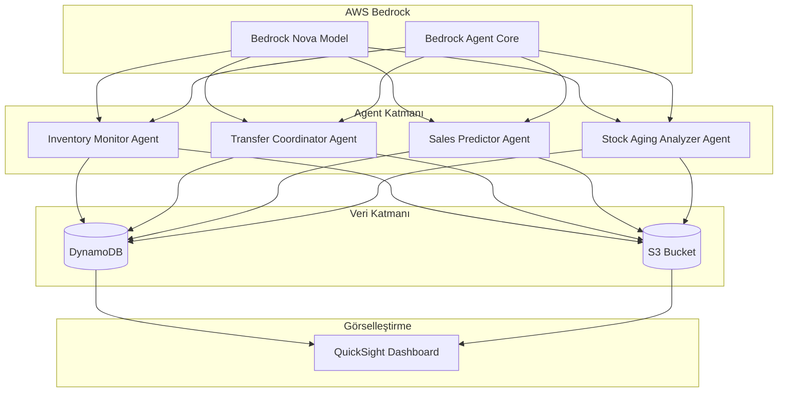
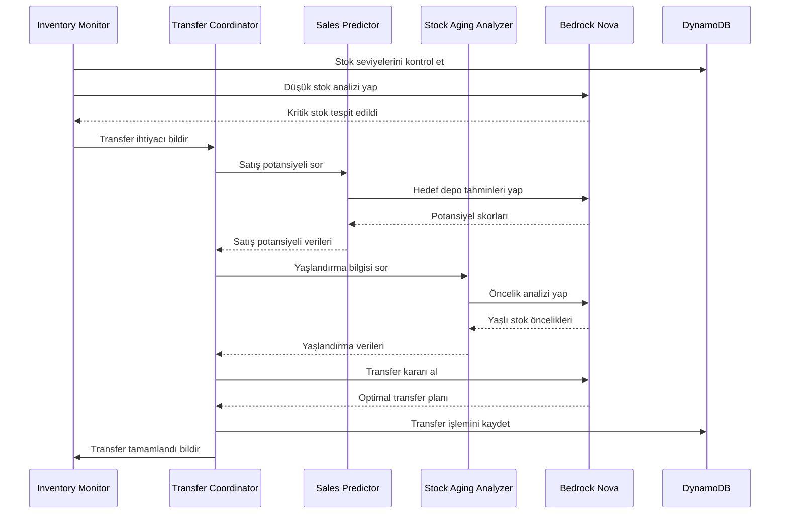

# Tasarım Dokümanı

## Genel Bakış

Çok-Agentlı Depo Stok Yönetim Sistemi, AWS Bedrock tabanlı otonom agent topluluğu kullanarak depolar arası akıllı stok yönetimi sağlar. Sistem, 4 ana agent'tan oluşur ve bu agentlar AWS Bedrock Agent Core primitives kullanarak birbirleriyle koordine çalışır. Tüm reasoning ve karar verme işlemleri AWS Bedrock Nova modelleri tarafından gerçekleştirilir.

## Mimari

### Üst Düzey Mimari



### Agent İletişim Akışı



## Bileşenler ve Arayüzler

### 1. Inventory Monitor Agent

**Sorumluluklar:**
- Tüm depolardaki stok seviyelerini sürekli izleme
- Kritik stok eşiklerini tespit etme
- Stok değişikliklerini loglama
- Diğer agentlara stok durumu bildirimi

**Bedrock Primitives Kullanımı:**
- `InvokeAgent`: Periyodik stok kontrolleri için
- `GetAgentMemory`: Geçmiş stok trendlerini hatırlama
- `UpdateAgentMemory`: Yeni stok verilerini kaydetme

**Arayüz:**
```python
class InventoryMonitorAgent:
    def check_stock_levels(self, warehouse_id: str) -> Dict[str, StockLevel]
    def detect_critical_stock(self, threshold: int) -> List[StockAlert]
    def get_stock_history(self, sku: str, warehouse_id: str, days: int) -> List[StockRecord]
    def notify_low_stock(self, alert: StockAlert) -> None
```

**Nova Model Kullanımı:**
- Model: `amazon.nova-lite-v1:0` (basit stok izleme ve anomali tespiti için yeterli)
- Kullanım: Stok trendlerini analiz etme, anomali tespiti
- Prompt yapısı: "Analyze stock levels for {sku} across {warehouses}. Identify critical situations."

### 2. Transfer Coordinator Agent

**Sorumluluklar:**
- Transfer ihtiyaçlarını koordine etme
- Kaynak ve hedef depo seçimi
- Transfer miktarı hesaplama
- Transfer işlemlerini atomik olarak gerçekleştirme
- İnsan onayı gerektiren transferleri yönetme

**Bedrock Primitives Kullanımı:**
- `InvokeAgent`: Transfer kararları için
- `CreateAgentActionGroup`: Transfer işlem grubu oluşturma
- `ReturnControl`: İnsan onayı gerektiren durumlarda kontrol döndürme

**Arayüz:**
```python
class TransferCoordinatorAgent:
    def evaluate_transfer_need(self, alert: StockAlert) -> TransferDecision
    def select_source_warehouse(self, sku: str, quantity: int) -> str
    def select_target_warehouse(self, sku: str, sales_data: Dict) -> str
    def calculate_transfer_quantity(self, source: str, target: str, sku: str) -> int
    def execute_transfer(self, transfer: TransferPlan) -> TransferResult
    def request_human_approval(self, transfer: TransferPlan) -> ApprovalRequest
```

**Nova Model Kullanımı:**
- Model: `amazon.nova-pro-v1:0`
- Kullanım: Optimal transfer kararları alma, çoklu faktör analizi
- Prompt yapısı: "Given stock levels, sales potential, and aging data, determine optimal transfer plan."

### 3. Sales Predictor Agent

**Sorumluluklar:**
- Geçmiş satış verilerini analiz etme
- Depo bazında satış potansiyeli hesaplama
- Mevsimsel trendleri tespit etme
- Bölgesel faktörleri değerlendirme

**Bedrock Primitives Kullanımı:**
- `InvokeAgent`: Satış tahminleri için
- `GetAgentMemory`: Geçmiş satış verilerini okuma
- `UpdateAgentMemory`: Yeni tahminleri kaydetme

**Arayüz:**
```python
class SalesPredictorAgent:
    def predict_sales_potential(self, sku: str, warehouse_id: str, days: int) -> float
    def analyze_historical_sales(self, sku: str, months: int) -> SalesAnalysis
    def detect_seasonal_trends(self, sku: str) -> SeasonalPattern
    def calculate_regional_factors(self, warehouse_id: str) -> RegionalScore
```

**Nova Model Kullanımı:**
- Model: `amazon.nova-pro-v1:0`
- Kullanım: Satış tahminleri, trend analizi
- Prompt yapısı: "Analyze 12-month sales history for {sku}. Predict next 30-day sales potential for each warehouse."

### 4. Stock Aging Analyzer Agent

**Sorumluluklar:**
- Ürün yaşlandırma sürelerini takip etme
- Kritik yaşlandırma eşiklerini tespit etme
- Kategori bazlı yaşlandırma kuralları uygulama
- Yaşlı stoklar için öncelikli transfer önerileri

**Bedrock Primitives Kullanımı:**
- `InvokeAgent`: Yaşlandırma analizi için
- `GetAgentMemory`: Ürün giriş tarihlerini okuma

**Arayüz:**
```python
class StockAgingAnalyzerAgent:
    def calculate_aging_days(self, sku: str, warehouse_id: str) -> int
    def detect_critical_aging(self, threshold_days: int) -> List[AgingAlert]
    def get_category_threshold(self, category: str) -> int
    def prioritize_aged_stock(self, alerts: List[AgingAlert]) -> List[AgingAlert]
```

**Nova Model Kullanımı:**
- Model: `amazon.nova-lite-v1:0` (daha basit analiz için)
- Kullanım: Yaşlandırma öncelik sıralaması
- Prompt yapısı: "Prioritize aged stock items based on category, age, and warehouse capacity."

## Veri Modelleri

### DynamoDB Tablo Yapıları

#### 1. Warehouses Tablosu
```json
{
  "TableName": "Warehouses",
  "KeySchema": [
    {"AttributeName": "warehouse_id", "KeyType": "HASH"}
  ],
  "AttributeDefinitions": [
    {"AttributeName": "warehouse_id", "AttributeType": "S"}
  ],
  "Schema": {
    "warehouse_id": "string (PK)",
    "name": "string",
    "location": "string",
    "region": "string",
    "capacity": "number",
    "created_at": "string (ISO 8601)"
  }
}
```

**Örnek Veri:**
```json
{
  "warehouse_id": "WH001",
  "name": "İstanbul Merkez Depo",
  "location": "İstanbul, Türkiye",
  "region": "Marmara",
  "capacity": 10000,
  "created_at": "2024-01-01T00:00:00Z"
}
```

#### 2. Products Tablosu
```json
{
  "TableName": "Products",
  "KeySchema": [
    {"AttributeName": "sku", "KeyType": "HASH"}
  ],
  "AttributeDefinitions": [
    {"AttributeName": "sku", "AttributeType": "S"},
    {"AttributeName": "category", "AttributeType": "S"}
  ],
  "GlobalSecondaryIndexes": [
    {
      "IndexName": "CategoryIndex",
      "KeySchema": [
        {"AttributeName": "category", "KeyType": "HASH"}
      ]
    }
  ],
  "Schema": {
    "sku": "string (PK)",
    "name": "string",
    "category": "string (GSI)",
    "price": "number",
    "aging_threshold_days": "number",
    "created_at": "string (ISO 8601)"
  }
}
```

**Örnek Veri:**
```json
{
  "sku": "SKU001",
  "name": "Laptop Dell XPS 15",
  "category": "Elektronik",
  "price": 25000.00,
  "aging_threshold_days": 90,
  "created_at": "2024-01-01T00:00:00Z"
}
```

#### 3. Inventory Tablosu
```json
{
  "TableName": "Inventory",
  "KeySchema": [
    {"AttributeName": "warehouse_id", "KeyType": "HASH"},
    {"AttributeName": "sku", "KeyType": "RANGE"}
  ],
  "AttributeDefinitions": [
    {"AttributeName": "warehouse_id", "AttributeType": "S"},
    {"AttributeName": "sku", "AttributeType": "S"}
  ],
  "Schema": {
    "warehouse_id": "string (PK)",
    "sku": "string (SK)",
    "quantity": "number",
    "min_threshold": "number",
    "max_threshold": "number",
    "last_updated": "string (ISO 8601)",
    "received_date": "string (ISO 8601)"
  }
}
```

**Örnek Veri:**
```json
{
  "warehouse_id": "WH001",
  "sku": "SKU001",
  "quantity": 45,
  "min_threshold": 20,
  "max_threshold": 100,
  "last_updated": "2024-01-15T10:30:00Z",
  "received_date": "2023-11-01T00:00:00Z"
}
```

#### 4. SalesHistory Tablosu
```json
{
  "TableName": "SalesHistory",
  "KeySchema": [
    {"AttributeName": "warehouse_id", "KeyType": "HASH"},
    {"AttributeName": "date_sku", "KeyType": "RANGE"}
  ],
  "AttributeDefinitions": [
    {"AttributeName": "warehouse_id", "AttributeType": "S"},
    {"AttributeName": "date_sku", "AttributeType": "S"}
  ],
  "Schema": {
    "warehouse_id": "string (PK)",
    "date_sku": "string (SK, format: YYYY-MM-DD#SKU)",
    "sku": "string",
    "date": "string (YYYY-MM-DD)",
    "quantity_sold": "number",
    "revenue": "number"
  }
}
```

**Örnek Veri:**
```json
{
  "warehouse_id": "WH001",
  "date_sku": "2024-01-15#SKU001",
  "sku": "SKU001",
  "date": "2024-01-15",
  "quantity_sold": 3,
  "revenue": 75000.00
}
```

#### 5. Transfers Tablosu
```json
{
  "TableName": "Transfers",
  "KeySchema": [
    {"AttributeName": "transfer_id", "KeyType": "HASH"}
  ],
  "AttributeDefinitions": [
    {"AttributeName": "transfer_id", "AttributeType": "S"},
    {"AttributeName": "status", "AttributeType": "S"},
    {"AttributeName": "created_at", "AttributeType": "S"}
  ],
  "GlobalSecondaryIndexes": [
    {
      "IndexName": "StatusTimeIndex",
      "KeySchema": [
        {"AttributeName": "status", "KeyType": "HASH"},
        {"AttributeName": "created_at", "KeyType": "RANGE"}
      ]
    }
  ],
  "Schema": {
    "transfer_id": "string (PK)",
    "source_warehouse_id": "string",
    "target_warehouse_id": "string",
    "sku": "string",
    "quantity": "number",
    "status": "string (pending|approved|in_transit|completed|rejected) (GSI PK)",
    "reason": "string",
    "requires_approval": "boolean",
    "approved_by": "string (optional)",
    "created_at": "string (ISO 8601, GSI SK)",
    "completed_at": "string (ISO 8601, optional)"
  }
}
```

**Örnek Veri:**
```json
{
  "transfer_id": "TRF001",
  "source_warehouse_id": "WH002",
  "target_warehouse_id": "WH001",
  "sku": "SKU001",
  "quantity": 15,
  "status": "completed",
  "reason": "Low stock at target warehouse",
  "requires_approval": false,
  "created_at": "2024-01-15T11:00:00Z",
  "completed_at": "2024-01-15T14:30:00Z"
}
```

#### 6. AgentDecisions Tablosu (Audit Log)
```json
{
  "TableName": "AgentDecisions",
  "KeySchema": [
    {"AttributeName": "decision_id", "KeyType": "HASH"}
  ],
  "AttributeDefinitions": [
    {"AttributeName": "decision_id", "AttributeType": "S"},
    {"AttributeName": "agent_name", "AttributeType": "S"},
    {"AttributeName": "timestamp", "AttributeType": "S"}
  ],
  "GlobalSecondaryIndexes": [
    {
      "IndexName": "AgentTimeIndex",
      "KeySchema": [
        {"AttributeName": "agent_name", "KeyType": "HASH"},
        {"AttributeName": "timestamp", "KeyType": "RANGE"}
      ]
    }
  ],
  "Schema": {
    "decision_id": "string (PK)",
    "agent_name": "string (GSI PK)",
    "decision_type": "string",
    "input_data": "map",
    "output_data": "map",
    "reasoning": "string",
    "timestamp": "string (ISO 8601, GSI SK)"
  }
}
```

### S3 Veri Yapısı

**Bucket Yapısı:**
```
s3://warehouse-stock-management/
├── raw-data/
│   ├── warehouses.json
│   ├── products.json
│   └── initial-inventory.json
├── sales-history/
│   ├── 2023/
│   │   ├── 01/
│   │   │   └── sales-2023-01.csv
│   │   └── ...
│   └── 2024/
│       └── ...
├── agent-logs/
│   ├── inventory-monitor/
│   ├── transfer-coordinator/
│   ├── sales-predictor/
│   └── stock-aging-analyzer/
└── reports/
    ├── daily/
    ├── weekly/
    └── monthly/
```

### Simülasyon Verisi Formatları

#### Depo Verisi (warehouses.json)
```json
[
  {
    "warehouse_id": "WH001",
    "name": "İstanbul Merkez Depo",
    "location": "İstanbul, Türkiye",
    "region": "Marmara",
    "capacity": 10000
  },
  {
    "warehouse_id": "WH002",
    "name": "Ankara Depo",
    "location": "Ankara, Türkiye",
    "region": "İç Anadolu",
    "capacity": 8000
  },
  {
    "warehouse_id": "WH003",
    "name": "İzmir Depo",
    "location": "İzmir, Türkiye",
    "region": "Ege",
    "capacity": 7000
  },
  {
    "warehouse_id": "WH004",
    "name": "Antalya Depo",
    "location": "Antalya, Türkiye",
    "region": "Akdeniz",
    "capacity": 5000
  },
  {
    "warehouse_id": "WH005",
    "name": "Bursa Depo",
    "location": "Bursa, Türkiye",
    "region": "Marmara",
    "capacity": 6000
  },
  {
    "warehouse_id": "WH006",
    "name": "Trabzon Depo",
    "location": "Trabzon, Türkiye",
    "region": "Karadeniz",
    "capacity": 4000
  }
]
```

#### Ürün Kategorileri
```json
{
  "categories": [
    {
      "name": "Elektronik",
      "aging_threshold_days": 90,
      "min_stock_multiplier": 1.5
    },
    {
      "name": "Giyim",
      "aging_threshold_days": 180,
      "min_stock_multiplier": 2.0
    },
    {
      "name": "Gıda",
      "aging_threshold_days": 30,
      "min_stock_multiplier": 3.0
    },
    {
      "name": "Mobilya",
      "aging_threshold_days": 365,
      "min_stock_multiplier": 1.0
    },
    {
      "name": "Kitap",
      "aging_threshold_days": 730,
      "min_stock_multiplier": 1.2
    },
    {
      "name": "Oyuncak",
      "aging_threshold_days": 180,
      "min_stock_multiplier": 2.5
    },
    {
      "name": "Spor Malzemeleri",
      "aging_threshold_days": 365,
      "min_stock_multiplier": 1.5
    },
    {
      "name": "Ev Aletleri",
      "aging_threshold_days": 180,
      "min_stock_multiplier": 1.3
    },
    {
      "name": "Kozmetik",
      "aging_threshold_days": 365,
      "min_stock_multiplier": 2.0
    },
    {
      "name": "Otomotiv",
      "aging_threshold_days": 730,
      "min_stock_multiplier": 1.0
    }
  ]
}
```

#### Satış Verisi Üretim Kuralları
```python
# Her SKU için 12 aylık satış verisi üretimi
sales_generation_rules = {
    "base_daily_sales": {
        "min": 1,
        "max": 10
    },
    "seasonal_multipliers": {
        "Elektronik": {
            "high_season": [11, 12, 1],  # Kasım, Aralık, Ocak
            "multiplier": 2.5
        },
        "Giyim": {
            "high_season": [9, 10, 11],  # Eylül, Ekim, Kasım
            "multiplier": 2.0
        },
        "Gıda": {
            "high_season": [6, 7, 8],  # Haziran, Temmuz, Ağustos
            "multiplier": 1.5
        }
    },
    "regional_multipliers": {
        "Marmara": 1.5,
        "İç Anadolu": 1.2,
        "Ege": 1.3,
        "Akdeniz": 1.1,
        "Karadeniz": 1.0
    }
}
```

## AWS Servisleri ve SDK Kullanımı

### 1. AWS Bedrock Agent Core

**Kullanım Alanları:**
- Agent oluşturma ve yönetimi
- Agent primitives (InvokeAgent, ReturnControl, GetAgentMemory)
- Agent action groups tanımlama
- Agent koordinasyonu

**SDK:**
```python
import boto3

bedrock_agent = boto3.client('bedrock-agent')
bedrock_agent_runtime = boto3.client('bedrock-agent-runtime')

# Agent oluşturma
response = bedrock_agent.create_agent(
    agentName='InventoryMonitorAgent',
    agentResourceRoleArn='arn:aws:iam::ACCOUNT:role/BedrockAgentRole',
    foundationModel='amazon.nova-pro-v1:0',
    instruction='Monitor warehouse inventory levels and detect critical stock situations.'
)

# Agent çağırma
response = bedrock_agent_runtime.invoke_agent(
    agentId='AGENT_ID',
    agentAliasId='ALIAS_ID',
    sessionId='SESSION_ID',
    inputText='Check stock levels for all warehouses'
)
```

### 2. AWS Bedrock Nova Models

**Model Seçimi:**
- **amazon.nova-pro-v1:0**: Transfer Coordinator, Sales Predictor için (karmaşık reasoning)
- **amazon.nova-lite-v1:0**: Inventory Monitor, Stock Aging Analyzer için (basit analiz)

**SDK:**
```python
bedrock_runtime = boto3.client('bedrock-runtime')

# Nova model çağırma
response = bedrock_runtime.invoke_model(
    modelId='amazon.nova-pro-v1:0',
    contentType='application/json',
    accept='application/json',
    body=json.dumps({
        "messages": [
            {
                "role": "user",
                "content": "Analyze stock levels and recommend transfer actions."
            }
        ],
        "inferenceConfig": {
            "max_new_tokens": 1000,
            "temperature": 0.7
        }
    })
)
```

### 3. Amazon DynamoDB

**SDK:**
```python
dynamodb = boto3.resource('dynamodb')

# Tablo referansları
warehouses_table = dynamodb.Table('Warehouses')
inventory_table = dynamodb.Table('Inventory')
transfers_table = dynamodb.Table('Transfers')

# Stok sorgulama
response = inventory_table.query(
    KeyConditionExpression='warehouse_id = :wh_id',
    ExpressionAttributeValues={
        ':wh_id': 'WH001'
    }
)

# Transfer kaydetme (atomik işlem - DynamoDB Transactions kullanarak)
dynamodb_client = boto3.client('dynamodb')

dynamodb_client.transact_write_items(
    TransactItems=[
        {
            'Update': {
                'TableName': 'Inventory',
                'Key': {
                    'warehouse_id': {'S': 'WH002'},
                    'sku': {'S': 'SKU001'}
                },
                'UpdateExpression': 'SET quantity = quantity - :qty',
                'ConditionExpression': 'quantity >= :qty',
                'ExpressionAttributeValues': {
                    ':qty': {'N': '15'}
                }
            }
        },
        {
            'Update': {
                'TableName': 'Inventory',
                'Key': {
                    'warehouse_id': {'S': 'WH001'},
                    'sku': {'S': 'SKU001'}
                },
                'UpdateExpression': 'SET quantity = quantity + :qty',
                'ExpressionAttributeValues': {
                    ':qty': {'N': '15'}
                }
            }
        },
        {
            'Put': {
                'TableName': 'Transfers',
                'Item': {
                    'transfer_id': {'S': 'TRF001'},
                    'source_warehouse_id': {'S': 'WH002'},
                    'target_warehouse_id': {'S': 'WH001'},
                    'sku': {'S': 'SKU001'},
                    'quantity': {'N': '15'},
                    'status': {'S': 'completed'},
                    'created_at': {'S': datetime.now().isoformat()}
                }
            }
        }
    ]
)
```

### 4. Amazon S3

**SDK:**
```python
s3 = boto3.client('s3')

# Simülasyon verisi yükleme
s3.put_object(
    Bucket='warehouse-stock-management',
    Key='raw-data/warehouses.json',
    Body=json.dumps(warehouses_data)
)

# Agent log kaydetme
s3.put_object(
    Bucket='warehouse-stock-management',
    Key=f'agent-logs/inventory-monitor/{timestamp}.json',
    Body=json.dumps(log_data)
)
```

### 5. Amazon QuickSight (Opsiyonel)

**Kullanım:**
- Agent kararlarını görselleştirme
- Transfer metriklerini dashboard'da gösterme
- Stok trendlerini analiz etme

**Veri Kaynakları:**
- DynamoDB tabloları
- S3'teki agent logları

## Doğruluk Özellikleri (Correctness Properties)

*Bir özellik (property), sistemin tüm geçerli çalıştırmalarında doğru olması gereken bir karakteristik veya davranıştır - esasen, sistemin ne yapması gerektiğine dair formal bir ifadedir. Özellikler, insan tarafından okunabilir spesifikasyonlar ile makine tarafından doğrulanabilir doğruluk garantileri arasında köprü görevi görür.*

### Özellik 1: Düşük Stok Tespiti ve Transfer İhtiyacı
*Herhangi bir* depo ve SKU için, stok seviyesi minimum eşiğin altına düştüğünde, sistem bir uyarı oluşturmalı ve transfer ihtiyacını tespit etmelidir.
**Doğrular: Gereksinim 1.2, 2.1**

### Özellik 2: Minimum Stok Eşiği Saklama
*Herhangi bir* depo için, kaydedilen minimum stok eşiği daha sonra geri okunabilmelidir (round-trip özelliği).
**Doğrular: Gereksinim 1.3**

### Özellik 3: Kaynak Depo Validasyonu
*Herhangi bir* transfer işlemi için, seçilen kaynak depo yeterli stok seviyesine sahip olmalı ve transfer başlatılmadan önce bu doğrulanmalıdır.
**Doğrular: Gereksinim 2.2, 6.2**

### Özellik 4: Transfer Miktarı Hesaplama
*Herhangi bir* transfer kararı için, hesaplanan transfer miktarı kaynak deponun mevcut stok miktarını aşmamalıdır.
**Doğrular: Gereksinim 2.3**

### Özellik 5: Transfer Öncesi Stok Tutarlılığı
*Herhangi bir* transfer işlemi için, başlatılmadan önce hem kaynak hem hedef deponun stok verileri tutarlı olmalıdır.
**Doğrular: Gereksinim 2.4**

### Özellik 6: Transfer Sonrası Stok Korunumu (Invariant)
*Herhangi bir* transfer işlemi için, transfer öncesi ve sonrası toplam sistem stok miktarı aynı kalmalıdır (stok korunumu).
**Doğrular: Gereksinim 2.5**

### Özellik 7: Satış Potansiyeli Hesaplama
*Herhangi bir* depo ve SKU kombinasyonu için, sistem bir satış potansiyeli skoru hesaplayabilmelidir.
**Doğrular: Gereksinim 3.1**

### Özellik 8: Satış Potansiyeline Göre Depo Seçimi
*Herhangi bir* transfer kararı için, birden fazla uygun hedef depo olduğunda, seçilen depo en yüksek satış potansiyeline sahip olmalıdır.
**Doğrular: Gereksinim 3.2, 3.5**

### Özellik 9: Yaşlandırma Süresi Takibi
*Herhangi bir* SKU ve depo kombinasyonu için, sistem ürünün depoda kalma süresini (yaşlandırma) hesaplayabilmelidir.
**Doğrular: Gereksinim 4.1**

### Özellik 10: Yaşlı Stok Önceliklendirme
*Herhangi bir* transfer kararı için, yaşlandırma süresi kritik eşiği aşan ürünler için öncelikli transfer önerisi oluşturulmalı ve yaşlı stoklar daha yeni stoklardan önce transfer edilmelidir.
**Doğrular: Gereksinim 4.2, 4.4**

### Özellik 11: Kategori Bazlı Yaşlandırma Eşikleri
*Herhangi bir* ürün kategorisi için, sistem o kategoriye özgü yaşlandırma eşiği uygulamalıdır.
**Doğrular: Gereksinim 4.3**

### Özellik 12: Agent İletişim Protokolü
*Herhangi bir* agent, karar almak için bilgiye ihtiyaç duyduğunda, ilgili agent'tan veri talep edebilmeli ve yanıt alabilmelidir.
**Doğrular: Gereksinim 5.1**

### Özellik 13: Eşzamanlı Kaynak Erişimi Kontrolü
*Herhangi bir* eşzamanlı agent işlemi için, aynı kaynağa (depo/SKU) erişim çakışmaları önlenmelidir.
**Doğrular: Gereksinim 5.3**

### Özellik 14: Agent Karar Loglama
*Herhangi bir* agent kararı ve iletişimi için, sistem bu işlemi loglamalıdır.
**Doğrular: Gereksinim 5.4, 6.5**

### Özellik 15: Hata Bildirimi
*Herhangi bir* agent hata ile karşılaştığında, sistem diğer ilgili agentları bilgilendirmelidir.
**Doğrular: Gereksinim 5.6**

### Özellik 16: Atomik Transfer İşlemleri
*Herhangi bir* transfer işlemi için, stok güncellemeleri atomik olmalıdır - ya her iki depo da güncellenir ya da hiçbiri güncellenmez.
**Doğrular: Gereksinim 6.1**

### Özellik 17: Negatif Stok Yasağı (Invariant)
*Herhangi bir* işlem sonrasında, tüm depolardaki tüm SKU'ların stok seviyeleri negatif olmamalıdır.
**Doğrular: Gereksinim 6.3**

### Özellik 18: Eşzamanlı Transfer Tutarlılığı
*Herhangi bir* eşzamanlı transfer işlemleri seti için, tüm işlemler tamamlandığında toplam sistem stok miktarı tutarlı olmalıdır.
**Doğrular: Gereksinim 6.4**

### Özellik 19: Stok Toplam Doğrulama
*Herhangi bir* zaman noktasında, tüm depolardaki bir SKU'nun toplam stok miktarı, sistem kayıtlarındaki toplam ile eşleşmelidir.
**Doğrular: Gereksinim 6.6**

### Özellik 20: Bedrock API Hata Yönetimi
*Herhangi bir* Bedrock API çağrısı için, hata durumunda sistem hatayı yakalamalı ve retry mekanizması uygulamalıdır.
**Doğrular: Gereksinim 7.4**

### Özellik 21: Bedrock Metrik Loglama
*Herhangi bir* Bedrock API çağrısı için, sistem kullanım metriklerini loglamalıdır.
**Doğrular: Gereksinim 7.5**

### Özellik 22: Satış Verisi Simülasyonu
*Herhangi bir* SKU için, sistem 12 aylık geçmiş satış verisi üretmelidir.
**Doğrular: Gereksinim 8.4**

### Özellik 23: Gerçekçi Stok Seviyeleri
*Herhangi bir* depo için, üretilen başlangıç stok seviyeleri tanımlı gerçekçi aralıkta (0 ile depo kapasitesi arası) olmalıdır.
**Doğrular: Gereksinim 8.5**

### Özellik 24: Tutarlı Yaşlandırma Verisi
*Herhangi bir* ürün için, üretilen yaşlandırma verisi tutarlı olmalıdır (giriş tarihi bugünden önce olmalı).
**Doğrular: Gereksinim 8.6**

### Özellik 25: Yapılandırılmış Veri Formatı (Round-trip)
*Herhangi bir* üretilen veri için, JSON/CSV formatında kaydedilip geri okunduğunda aynı veri yapısı elde edilmelidir.
**Doğrular: Gereksinim 8.7**

### Özellik 26: Rate Limit Yönetimi
*Herhangi bir* Bedrock API çağrı dizisi için, sistem rate limitine yaklaşıldığında throttling uygulamalıdır.
**Doğrular: Gereksinim 9.4**

### Özellik 27: Yüksek Değerli Transfer Onayı
*Herhangi bir* transfer için, değer tanımlı eşiği aştığında sistem insan onayı talep etmelidir.
**Doğrular: Gereksinim 10.1**

### Özellik 28: Onay Kuyruğu Yönetimi
*Herhangi bir* onay gerektiren işlem için, işlem onay alınana kadar kuyrukta tutulmalıdır.
**Doğrular: Gereksinim 10.2**

### Özellik 29: Onay Sonrası Transfer Devamı
*Herhangi bir* onay bekleyen transfer için, insan onayı alındığında transfer işlemi tamamlanmalıdır.
**Doğrular: Gereksinim 10.3**

### Özellik 30: Red Sonrası Alternatif Öneriler
*Herhangi bir* reddedilen transfer için, sistem alternatif çözümler önermeye devam etmelidir.
**Doğrular: Gereksinim 10.4**

### Özellik 31: Yapılandırılabilir Onay Eşikleri (Round-trip)
*Herhangi bir* onay eşiği için, kaydedilip geri okunduğunda aynı değer elde edilmelidir.
**Doğrular: Gereksinim 10.5**

### Özellik 32: Çift Mod Çalışma
*Herhangi bir* sistem konfigürasyonu için, sistem hem tam otonom hem de insan gözetimli modda çalışabilmelidir.
**Doğrular: Gereksinim 10.6**


## Hata Yönetimi

### Agent Hataları

**Hata Tipleri:**
1. **Bedrock API Hataları**: Rate limiting, timeout, model unavailable
2. **Veri Tutarsızlığı**: Stok negatif, transfer validasyon hatası
3. **Agent İletişim Hataları**: Agent yanıt vermiyor, timeout
4. **DynamoDB Hataları**: Throttling, connection errors

**Hata Yönetim Stratejisi:**

```python
class AgentErrorHandler:
    def handle_bedrock_error(self, error: Exception) -> RetryDecision:
        """
        Bedrock API hatalarını yönetir
        - Rate limit: Exponential backoff ile retry
        - Timeout: 3 kez retry
        - Model unavailable: Alternatif model kullan
        """
        if isinstance(error, RateLimitError):
            return RetryDecision(
                should_retry=True,
                backoff_seconds=calculate_exponential_backoff(),
                max_retries=5
            )
        elif isinstance(error, TimeoutError):
            return RetryDecision(
                should_retry=True,
                backoff_seconds=2,
                max_retries=3
            )
        else:
            return RetryDecision(should_retry=False)
    
    def handle_data_inconsistency(self, error: DataError) -> RecoveryAction:
        """
        Veri tutarsızlığı hatalarını yönetir
        - Negatif stok: İşlemi geri al, alarm oluştur
        - Transfer validasyon: İşlemi reddet, alternatif öner
        """
        if error.type == "negative_stock":
            self.rollback_transaction(error.transaction_id)
            self.create_alert(error)
            return RecoveryAction.ROLLBACK
        elif error.type == "validation_failed":
            self.reject_transfer(error.transfer_id)
            self.suggest_alternatives(error)
            return RecoveryAction.REJECT
    
    def handle_agent_communication_error(self, error: CommunicationError) -> FallbackAction:
        """
        Agent iletişim hatalarını yönetir
        - Agent timeout: Cached data kullan
        - Agent unavailable: Fallback agent kullan
        """
        if error.type == "timeout":
            return FallbackAction.USE_CACHED_DATA
        elif error.type == "unavailable":
            return FallbackAction.USE_FALLBACK_AGENT
```

### Hata Loglama

**Log Formatı:**
```json
{
  "timestamp": "2024-01-15T10:30:00Z",
  "error_id": "ERR001",
  "agent_name": "TransferCoordinatorAgent",
  "error_type": "ValidationError",
  "error_message": "Insufficient stock at source warehouse",
  "context": {
    "transfer_id": "TRF001",
    "source_warehouse": "WH002",
    "sku": "SKU001",
    "requested_quantity": 50,
    "available_quantity": 30
  },
  "recovery_action": "REJECT",
  "severity": "WARNING"
}
```

### Circuit Breaker Pattern

Bedrock API çağrıları için circuit breaker:

```python
class BedrockCircuitBreaker:
    def __init__(self):
        self.failure_threshold = 5
        self.timeout_seconds = 60
        self.state = "CLOSED"  # CLOSED, OPEN, HALF_OPEN
        self.failure_count = 0
        self.last_failure_time = None
    
    def call_bedrock(self, func, *args, **kwargs):
        if self.state == "OPEN":
            if self._should_attempt_reset():
                self.state = "HALF_OPEN"
            else:
                raise CircuitBreakerOpenError()
        
        try:
            result = func(*args, **kwargs)
            self._on_success()
            return result
        except Exception as e:
            self._on_failure()
            raise e
    
    def _on_failure(self):
        self.failure_count += 1
        self.last_failure_time = datetime.now()
        if self.failure_count >= self.failure_threshold:
            self.state = "OPEN"
    
    def _on_success(self):
        self.failure_count = 0
        self.state = "CLOSED"
```

## Test Stratejisi

### İkili Test Yaklaşımı

Sistem hem **unit testler** hem de **property-based testler** kullanarak kapsamlı test edilecektir:

- **Unit testler**: Spesifik örnekler, edge case'ler ve hata durumları
- **Property testler**: Tüm girdiler üzerinde evrensel özellikler

### Property-Based Testing

**Test Kütüphanesi**: Hypothesis (Python için)

**Konfigürasyon**:
- Her property test minimum 100 iterasyon çalıştırılacak
- Her test tasarım dokümanındaki özelliğe referans verecek
- Tag formatı: `Feature: multi-agent-warehouse-stock-management, Property {numara}: {özellik_metni}`

**Örnek Property Test:**

```python
from hypothesis import given, strategies as st
import pytest

@given(
    warehouse_id=st.text(min_size=1, max_size=10),
    sku=st.text(min_size=1, max_size=10),
    quantity=st.integers(min_value=0, max_value=1000),
    threshold=st.integers(min_value=1, max_value=100)
)
@pytest.mark.property_test
@pytest.mark.tag("Feature: multi-agent-warehouse-stock-management, Property 1: Düşük Stok Tespiti")
def test_low_stock_detection_property(warehouse_id, sku, quantity, threshold):
    """
    Özellik 1: Düşük Stok Tespiti ve Transfer İhtiyacı
    Herhangi bir depo ve SKU için, stok seviyesi minimum eşiğin altına 
    düştüğünde, sistem bir uyarı oluşturmalı ve transfer ihtiyacını tespit etmelidir.
    """
    # Arrange
    inventory_monitor = InventoryMonitorAgent()
    inventory_monitor.set_threshold(warehouse_id, sku, threshold)
    inventory_monitor.update_stock(warehouse_id, sku, quantity)
    
    # Act
    alerts = inventory_monitor.detect_critical_stock(threshold)
    
    # Assert
    if quantity < threshold:
        assert len(alerts) > 0
        assert any(a.sku == sku and a.warehouse_id == warehouse_id for a in alerts)
    else:
        assert not any(a.sku == sku and a.warehouse_id == warehouse_id for a in alerts)
```

### Unit Testing

**Test Kategorileri:**

1. **Agent Davranış Testleri**
```python
def test_inventory_monitor_detects_low_stock():
    """Spesifik örnek: Stok 10, eşik 20 olduğunda uyarı oluşturulmalı"""
    monitor = InventoryMonitorAgent()
    monitor.set_threshold("WH001", "SKU001", 20)
    monitor.update_stock("WH001", "SKU001", 10)
    
    alerts = monitor.detect_critical_stock(20)
    
    assert len(alerts) == 1
    assert alerts[0].sku == "SKU001"
```

2. **Entegrasyon Testleri**
```python
def test_transfer_coordinator_integration():
    """Agent'lar arası iletişim testi"""
    monitor = InventoryMonitorAgent()
    coordinator = TransferCoordinatorAgent()
    predictor = SalesPredictorAgent()
    
    # Düşük stok oluştur
    monitor.update_stock("WH001", "SKU001", 5)
    alert = monitor.detect_critical_stock(20)[0]
    
    # Transfer koordinasyonu
    decision = coordinator.evaluate_transfer_need(alert)
    
    assert decision.should_transfer == True
    assert decision.target_warehouse is not None
```

3. **Edge Case Testleri**
```python
def test_transfer_with_zero_stock():
    """Edge case: Sıfır stokla transfer denemesi"""
    coordinator = TransferCoordinatorAgent()
    
    with pytest.raises(ValidationError):
        coordinator.execute_transfer(
            source="WH001",
            target="WH002",
            sku="SKU001",
            quantity=10
        )

def test_concurrent_transfers_same_sku():
    """Edge case: Aynı SKU için eşzamanlı transferler"""
    coordinator = TransferCoordinatorAgent()
    
    # İki transfer paralel başlat
    transfer1 = coordinator.execute_transfer_async(
        source="WH001", target="WH002", sku="SKU001", quantity=10
    )
    transfer2 = coordinator.execute_transfer_async(
        source="WH001", target="WH003", sku="SKU001", quantity=10
    )
    
    # Her iki transfer de tamamlanmalı ve stok tutarlı olmalı
    results = [transfer1.result(), transfer2.result()]
    assert all(r.status == "completed" for r in results)
    
    # Toplam stok korunmalı
    total_stock = get_total_stock("SKU001")
    assert total_stock == initial_stock
```

4. **Hata Durumu Testleri**
```python
def test_bedrock_api_retry_on_rate_limit():
    """Bedrock rate limit durumunda retry"""
    with patch('boto3.client') as mock_client:
        mock_client.return_value.invoke_model.side_effect = [
            RateLimitError(),
            RateLimitError(),
            {"body": json.dumps({"result": "success"})}
        ]
        
        agent = TransferCoordinatorAgent()
        result = agent.make_decision(transfer_data)
        
        assert result is not None
        assert mock_client.return_value.invoke_model.call_count == 3
```

### Simülasyon Testleri

**Senaryo Tabanlı Testler:**

```python
def test_full_transfer_simulation():
    """
    Tam simülasyon: 6 depo, 100 SKU, 30 gün
    - Günlük satışlar simüle edilir
    - Agentlar otomatik kararlar alır
    - Tüm özellikler doğrulanır
    """
    # Setup
    simulation = WarehouseSimulation(
        num_warehouses=6,
        num_skus=100,
        duration_days=30
    )
    
    # Run
    simulation.run()
    
    # Verify properties
    assert simulation.verify_property("no_negative_stock")
    assert simulation.verify_property("stock_conservation")
    assert simulation.verify_property("all_decisions_logged")
    
    # Metrics
    metrics = simulation.get_metrics()
    assert metrics["total_transfers"] > 0
    assert metrics["avg_transfer_time"] < 10  # seconds
    assert metrics["stock_out_events"] < 5
```

### Test Veri Üretimi

**Hypothesis Stratejileri:**

```python
# Depo stratejisi
warehouse_strategy = st.builds(
    Warehouse,
    warehouse_id=st.text(min_size=5, max_size=10, alphabet=st.characters(whitelist_categories=('Lu', 'Nd'))),
    name=st.text(min_size=5, max_size=50),
    region=st.sampled_from(["Marmara", "İç Anadolu", "Ege", "Akdeniz", "Karadeniz"]),
    capacity=st.integers(min_value=1000, max_value=20000)
)

# SKU stratejisi
sku_strategy = st.builds(
    Product,
    sku=st.text(min_size=6, max_size=10, alphabet=st.characters(whitelist_categories=('Lu', 'Nd'))),
    name=st.text(min_size=10, max_size=100),
    category=st.sampled_from(["Elektronik", "Giyim", "Gıda", "Mobilya", "Kitap"]),
    price=st.floats(min_value=10.0, max_value=100000.0),
    aging_threshold_days=st.integers(min_value=30, max_value=730)
)

# Transfer stratejisi
transfer_strategy = st.builds(
    Transfer,
    source_warehouse=warehouse_strategy,
    target_warehouse=warehouse_strategy,
    sku=sku_strategy,
    quantity=st.integers(min_value=1, max_value=100)
).filter(lambda t: t.source_warehouse.warehouse_id != t.target_warehouse.warehouse_id)
```

### Test Kapsamı Hedefleri

- **Kod kapsamı**: Minimum %80
- **Property test kapsamı**: Tüm 32 özellik test edilmeli
- **Agent kapsamı**: Her agent için minimum 20 unit test
- **Entegrasyon test kapsamı**: Tüm agent iletişim senaryoları
- **Simülasyon test kapsamı**: Minimum 3 farklı senaryo (düşük yük, normal yük, yüksek yük)

### CI/CD Entegrasyonu

```yaml
# .github/workflows/test.yml
name: Test Suite

on: [push, pull_request]

jobs:
  test:
    runs-on: ubuntu-latest
    steps:
      - uses: actions/checkout@v2
      
      - name: Set up Python
        uses: actions/setup-python@v2
        with:
          python-version: '3.11'
      
      - name: Install dependencies
        run: |
          pip install -r requirements.txt
          pip install pytest hypothesis pytest-cov
      
      - name: Run unit tests
        run: pytest tests/unit/ -v --cov=src --cov-report=xml
      
      - name: Run property tests
        run: pytest tests/property/ -v --hypothesis-show-statistics
      
      - name: Run integration tests
        run: pytest tests/integration/ -v
      
      - name: Run simulation tests
        run: pytest tests/simulation/ -v --timeout=300
      
      - name: Upload coverage
        uses: codecov/codecov-action@v2
```

## Ekip Görev Dağılımı

### Geliştirici 1: AWS Altyapı ve Agent Mimarisi Uzmanı
**Sorumluluklar:**
- AWS Bedrock Agent Core entegrasyonu
- Agent primitives implementasyonu (InvokeAgent, ReturnControl, GetAgentMemory)
- DynamoDB ve S3 altyapısı kurulumu
- IAM rolleri ve güvenlik yapılandırması
- Agent orchestration mantığı
- Hata yönetimi ve circuit breaker implementasyonu
- CloudWatch monitoring ve alerting

**Tahmini Süre:** 5-6 hafta

### Geliştirici 2: Agent Mantığı ve İş Kuralları Uzmanı
**Sorumluluklar:**
- 4 agent'ın (Inventory Monitor, Sales Predictor, Stock Aging Analyzer, Transfer Coordinator) implementasyonu
- Agent karar mantığı ve algoritmaları
- Nova model entegrasyonu ve prompt engineering
- Agent arası iletişim protokolleri
- Stok yönetim mantığı ve validasyon kuralları
- Transfer koordinasyon algoritmaları
- İnsan onayı mekanizması

**Tahmini Süre:** 6-7 hafta

### Geliştirici 3: Test, Veri ve Görselleştirme Uzmanı
**Sorumluluklar:**
- Simülasyon verisi üretimi (6 depo, 100 SKU, 12 aylık satış verisi)
- Property-based testler (32 özellik için Hypothesis testleri)
- Unit testler (her agent için 20+ test)
- Entegrasyon ve simülasyon testleri
- QuickSight dashboard'ları
- CI/CD pipeline kurulumu
- Test coverage monitoring

**Tahmini Süre:** 5-6 hafta

## Teknoloji Stack'i

### Backend
- **Dil**: Python 3.11+
- **AWS SDK**: boto3
- **Agent Framework**: AWS Bedrock Agent SDK
- **LLM**: Amazon Bedrock Nova (nova-pro-v1:0, nova-lite-v1:0)

### Veri Katmanı
- **Database**: Amazon DynamoDB
- **Storage**: Amazon S3
- **Caching**: DynamoDB DAX (opsiyonel)

### Test
- **Unit Testing**: pytest
- **Property Testing**: Hypothesis
- **Mocking**: unittest.mock, moto (AWS mocking)
- **Coverage**: pytest-cov

### DevOps
- **CI/CD**: GitHub Actions
- **IaC**: AWS CDK veya CloudFormation
- **Monitoring**: CloudWatch, X-Ray
- **Visualization**: Amazon QuickSight

### Geliştirme Araçları
- **IDE**: VS Code, PyCharm
- **Linting**: pylint, black
- **Type Checking**: mypy
- **Documentation**: Sphinx

## Deployment Stratejisi

### Ortamlar
1. **Development**: Geliştirici testleri için
2. **Staging**: Entegrasyon testleri için
3. **Production**: Canlı sistem

### Deployment Adımları
1. DynamoDB tablolarını oluştur
2. S3 bucket'ları oluştur
3. IAM rollerini yapılandır
4. Bedrock Agent'ları oluştur
5. Lambda fonksiyonlarını deploy et
6. Simülasyon verisini yükle
7. QuickSight dashboard'larını kur
8. Monitoring ve alerting'i aktifleştir

### Rollback Stratejisi
- Lambda versiyonlama kullan
- DynamoDB point-in-time recovery aktif
- S3 versioning aktif
- Blue-green deployment pattern

## Maliyet Tahmini (Aylık)

### AWS Bedrock
- Nova Pro çağrıları: ~$200-500 (kullanıma bağlı)
- Nova Lite çağrıları: ~$50-150 (kullanıma bağlı)
- Agent Core: ~$100-200

### DynamoDB
- 6 tablo, orta yük: ~$50-100

### S3
- Storage + transfer: ~$20-50

### Lambda
- Orchestration fonksiyonları: ~$30-80

### QuickSight
- 1-3 kullanıcı: ~$24-72

**Toplam Tahmini Maliyet**: $474-1,152/ay

## Sonraki Adımlar

1. **Hemen Başlayın**: Görev 1 (AWS Altyapı) ve Görev 2 (Simülasyon Verisi) paralel başlatılabilir
2. **Ekip Toplantısı**: Mimari ve görev dağılımını gözden geçirin
3. **Repository Kurulumu**: GitHub repo oluşturun, branch stratejisi belirleyin
4. **AWS Hesap Hazırlığı**: Gerekli AWS servislerine erişim sağlayın
5. **Sprint Planning**: İlk 2 haftalık sprint'i planlayın

## MCP_PLACEHOLDER_START

### Genel Bakış

MCP (Model Context Protocol), Bedrock agentları ile veri katmanı (DynamoDB/S3) arasında standartlaştırılmış bir iletişim katmanı sağlar. Bu mimari, agent'ların veri kaynaklarına erişimini merkezileştirir, kod tekrarını önler ve test edilebilirliği artırır.

### MCP Sunucu Mimarisi

```
Bedrock Agents
    ↓
MCP Servers (Standardized Tool Interface)
    ↓
AWS Services (DynamoDB, S3)
```

Sistem 3 özel MCP sunucusu kullanır:

1. **Warehouse Data MCP Server** (`warehouse_data_server.py`)
2. **Transfer Operations MCP Server** (`transfer_ops_server.py`)
3. **Analytics MCP Server** (`analytics_server.py`)

### 1. Warehouse Data MCP Server

**Amaç**: Depo, envanter ve ürün verilerine erişim sağlar.

**Sağladığı Araçlar**:
- `get_inventory`: Belirli bir depo ve SKU için mevcut stok seviyesini getir
- `get_warehouse_info`: Depo bilgilerini (kapasite, konum) getir
- `list_low_stock_items`: Minimum eşiğin altındaki tüm ürünleri listele
- `get_product_info`: Ürün bilgilerini (kategori, yaşlandırma eşiği) getir
- `get_threshold`: Bir depo ve SKU için minimum stok eşiğini getir
- `set_threshold`: Bir depo ve SKU için minimum stok eşiğini ayarla
- `get_regional_data`: Belirli bir bölgedeki tüm depoları getir
- `get_products_by_category`: Belirli bir kategorideki tüm ürünleri getir
- `validate_transfer`: Transfer işleminin mümkün olup olmadığını doğrula
- `get_warehouse_capacity`: Depo kapasite kullanımını getir

**Eriştiği DynamoDB Tabloları**:
- Warehouses
- Inventory
- Products

**Kullanım Örneği**:
```python
# Inventory Monitor Agent kullanımı
inventory_data = mcp_client.call_tool(
    server="warehouse-data",
    tool="get_inventory",
    arguments={"warehouse_id": "WH001", "sku": "SKU001"}
)
```

### 2. Transfer Operations MCP Server

**Amaç**: Transfer işlemlerini yönetir, onay süreçlerini koordine eder ve agent kararlarını loglar.

**Sağladığı Araçlar**:
- `execute_transfer`: Depolar arası atomik stok transferi gerçekleştir
- `get_transfer_history`: Bir depo veya SKU için transfer geçmişini getir
- `get_transfer_status`: Belirli bir transferin durumunu getir
- `create_approval_request`: İnsan onayı için transfer talebi oluştur
- `approve_transfer`: Bekleyen bir transfer talebini onayla
- `reject_transfer`: Bekleyen bir transfer talebini reddet
- `log_decision`: Agent kararını denetim kaydına logla
- `get_agent_decisions`: Bir agent için karar geçmişini getir
- `rollback_transfer`: Tamamlanmış bir transferi geri al (acil durum)

**Eriştiği DynamoDB Tabloları**:
- Transfers
- ApprovalQueue
- AgentDecisions
- Inventory (atomik işlemler için)

**Atomik Transfer İşlemi**:
```python
# DynamoDB Transactions kullanarak atomik transfer
response = dynamodb_client.transact_write_items(
    TransactItems=[
        {'Update': {...}},  # Kaynak depodan düş
        {'Update': {...}},  # Hedef depoya ekle
        {'Put': {...}}      # Transfer kaydını oluştur
    ]
)
```

**Kullanım Örneği**:
```python
# Transfer Coordinator Agent kullanımı
transfer_result = mcp_client.call_tool(
    server="transfer-ops",
    tool="execute_transfer",
    arguments={
        "source_warehouse_id": "WH002",
        "target_warehouse_id": "WH001",
        "sku": "SKU001",
        "quantity": 15,
        "reason": "Low stock at target warehouse"
    }
)
```

### 3. Analytics MCP Server

**Amaç**: Satış geçmişi analizi, yaşlandırma hesaplamaları ve tahmine dayalı analizler sağlar.

**Sağladığı Araçlar**:
- `get_sales_history`: Bir SKU ve depo için geçmiş satış verilerini getir
- `calculate_sales_potential`: Bir depo ve SKU için satış potansiyeli skorunu hesapla
- `get_aging_data`: Bir depo ve SKU için ürün yaşlandırma bilgilerini getir
- `get_category_threshold`: Bir ürün kategorisi için yaşlandırma eşiğini getir
- `prioritize_aged_stock`: Yaşlandırma ciddiyetine göre önceliklendirilmiş yaşlı stok listesi
- `predict_demand`: Geçmiş verilere dayalı gelecek talep tahmini
- `get_regional_sales_multiplier`: Bir bölge için satış çarpanını getir
- `calculate_transfer_priority`: Birden fazla faktöre dayalı transfer öncelik skoru hesapla
- `get_seasonal_multiplier`: Bir kategori ve ay için mevsimsel satış çarpanını getir

**Eriştiği Veri Kaynakları**:
- S3 (sales-history bucket)
- DynamoDB (Products, Inventory, Warehouses)

**Kullanım Örneği**:
```python
# Sales Predictor Agent kullanımı
sales_potential = mcp_client.call_tool(
    server="analytics",
    tool="calculate_sales_potential",
    arguments={"sku": "SKU001", "warehouse_id": "WH001"}
)
```

### Agent-MCP Araç Eşleştirmesi

#### Inventory Monitor Agent
**İhtiyaç Duyduğu Araçlar**:
- `warehouse-data.get_inventory`
- `warehouse-data.get_threshold`
- `warehouse-data.list_low_stock_items`
- `transfer-ops.log_decision`

#### Transfer Coordinator Agent
**İhtiyaç Duyduğu Araçlar**:
- `warehouse-data.get_inventory`
- `warehouse-data.validate_transfer`
- `transfer-ops.execute_transfer`
- `transfer-ops.create_approval_request`
- `analytics.get_warehouse_capacity`
- `analytics.calculate_transfer_priority`

#### Sales Predictor Agent
**İhtiyaç Duyduğu Araçlar**:
- `analytics.get_sales_history`
- `analytics.calculate_sales_potential`
- `analytics.predict_demand`
- `warehouse-data.get_regional_data`
- `analytics.get_regional_sales_multiplier`
- `analytics.get_seasonal_multiplier`

#### Stock Aging Analyzer Agent
**İhtiyaç Duyduğu Araçlar**:
- `analytics.get_aging_data`
- `analytics.get_category_threshold`
- `analytics.prioritize_aged_stock`
- `warehouse-data.get_products_by_category`
- `transfer-ops.log_decision`

### MCP Mimarisinin Avantajları

1. **Merkezileştirilmiş Veri Erişimi**: Tüm veri erişim mantığı MCP sunucularında toplanır, agent kodunda tekrar önlenir.

2. **Standartlaştırılmış Arayüz**: Tüm agentlar aynı araç arayüzünü kullanır, tutarlılık sağlar.

3. **Kolay Test Edilebilirlik**: MCP sunucuları mock'lanabilir, unit testleri basitleştirir.
   ```python
   @given(warehouse_id=st.text(), sku=st.text(), quantity=st.integers(0, 1000))
   def test_property_1_low_stock_detection(warehouse_id, sku, quantity):
       with mock_mcp_server("warehouse-data") as mock:
           mock.set_response("get_inventory", {"quantity": quantity})
           agent = InventoryMonitorAgent(mcp_client=mock.client)
           alerts = agent.detect_critical_stock(threshold=20)
           if quantity < 20:
               assert len(alerts) > 0
   ```

4. **Güvenlik Katmanı**: MCP sunucuları erişim kontrolü uygulayabilir, hassas işlemleri korur.

5. **Hata Yönetimi**: Merkezi hata yönetimi ve retry mekanizmaları.

6. **Agent İletişimi**: MCP sunucuları agent'lar arası iletişim katmanı olarak görev yapabilir.

### MCP Konfigürasyonu

MCP sunucuları `.kiro/settings/mcp.json` dosyasında yapılandırılır:

```json
{
  "mcpServers": {
    "warehouse-data": {
      "command": "python",
      "args": ["-m", "mcp.warehouse_data_server"],
      "env": {
        "AWS_REGION": "us-east-1",
        "AWS_PROFILE": "default"
      },
      "disabled": false,
      "autoApprove": ["get_inventory", "get_warehouse_info", "get_product_info"]
    },
    "transfer-ops": {
      "command": "python",
      "args": ["-m", "mcp.transfer_ops_server"],
      "env": {
        "AWS_REGION": "us-east-1",
        "AWS_PROFILE": "default"
      },
      "disabled": false,
      "autoApprove": ["get_transfer_history", "get_transfer_status"]
    },
    "analytics": {
      "command": "python",
      "args": ["-m", "mcp.analytics_server"],
      "env": {
        "AWS_REGION": "us-east-1",
        "AWS_PROFILE": "default"
      },
      "disabled": false,
      "autoApprove": ["get_sales_history", "calculate_sales_potential"]
    }
  }
}
```

### Bedrock Agent Entegrasyonu

Bedrock agentları MCP araçlarını action groups aracılığıyla çağırır:

```python
def inventory_monitor_action_group(event):
    """Inventory Monitor Agent için action group"""
    
    # Agent input'unu parse et
    action = event['actionGroup']
    function = event['function']
    parameters = event.get('parameters', [])
    
    # MCP aracını çağır
    if function == "check_low_stock":
        warehouse_id = get_parameter(parameters, 'warehouse_id')
        
        result = mcp_client.call_tool(
            server="warehouse-data",
            tool="list_low_stock_items",
            arguments={"warehouse_id": warehouse_id}
        )
        
        # Agent'a yanıt dön
        return {
            "response": {
                "actionGroup": action,
                "function": function,
                "functionResponse": {
                    "responseBody": {
                        "TEXT": {
                            "body": json.dumps(result)
                        }
                    }
                }
            }
        }
```

### Özellik Testleri için MCP Kullanımı

MCP mimarisi, 32 doğruluk özelliğinin test edilmesini kolaylaştırır:

**Özellik 6 Örneği (Stok Korunumu)**:
```python
@given(
    source_wh=warehouse_strategy,
    target_wh=warehouse_strategy,
    sku=sku_strategy,
    quantity=st.integers(1, 100)
)
def test_property_6_stock_conservation(source_wh, target_wh, sku, quantity):
    """Transfer öncesi ve sonrası toplam sistem stok miktarı aynı kalmalıdır"""
    
    # Transfer öncesi toplam stok
    total_before = get_total_stock_via_mcp(sku)
    
    # Transfer gerçekleştir
    mcp_client.call_tool(
        server="transfer-ops",
        tool="execute_transfer",
        arguments={
            "source_warehouse_id": source_wh.id,
            "target_warehouse_id": target_wh.id,
            "sku": sku.id,
            "quantity": quantity
        }
    )
    
    # Transfer sonrası toplam stok
    total_after = get_total_stock_via_mcp(sku)
    
    # Stok korunumu doğrulaması
    assert total_before == total_after
```

### Performans Optimizasyonu

1. **Caching**: Sık erişilen veriler için MCP sunucularında cache mekanizması
2. **Batch Operations**: Birden fazla sorgu için batch araçları
3. **Connection Pooling**: DynamoDB ve S3 bağlantıları için connection pool
4. **Async Operations**: Uzun süren işlemler için asenkron araçlar

### Güvenlik ve Erişim Kontrolü

MCP sunucuları şu güvenlik önlemlerini uygular:

1. **IAM Rolleri**: Her MCP sunucusu minimum gerekli izinlerle çalışır
2. **Validasyon**: Tüm girdiler sunucu tarafında doğrulanır
3. **Rate Limiting**: Aşırı kullanımı önlemek için rate limiting
4. **Audit Logging**: Tüm araç çağrıları loglanır
5. **Encryption**: Hassas veriler şifrelenir

### Monitoring ve Debugging

MCP sunucuları CloudWatch'a metrik ve log gönderir:

```python
# Her araç çağrısı için metrik
cloudwatch.put_metric_data(
    Namespace='MCP/WarehouseData',
    MetricData=[
        {
            'MetricName': 'ToolInvocation',
            'Value': 1,
            'Unit': 'Count',
            'Dimensions': [
                {'Name': 'ToolName', 'Value': tool_name},
                {'Name': 'Success', 'Value': str(success)}
            ]
        }
    ]
)
```

### Gelecek Geliştirmeler

1. **GraphQL API**: MCP sunucuları üzerinden GraphQL endpoint'leri
2. **WebSocket Support**: Gerçek zamanlı veri güncellemeleri için
3. **Multi-Region**: Çoklu bölge desteği için MCP sunucu replikasyonu
4. **Advanced Analytics**: Makine öğrenimi modelleri için özel MCP sunucusu
