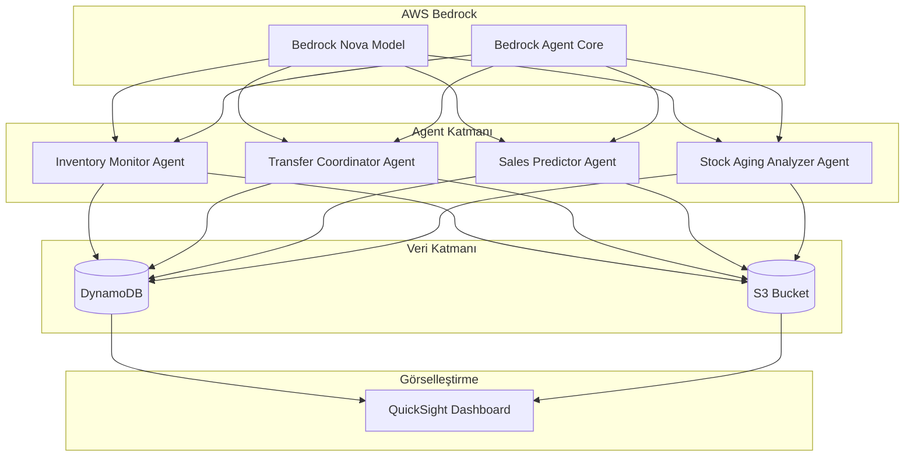
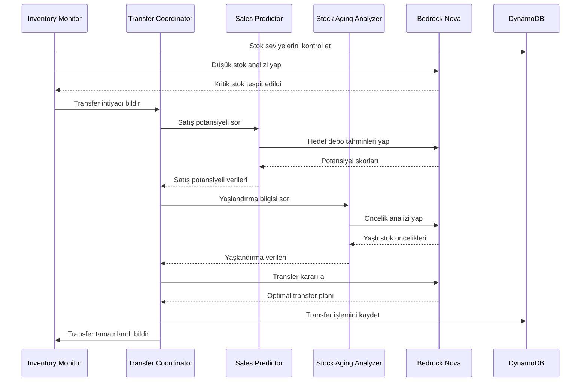

# Tasarım Dokümanı

## Genel Bakış

Çok-Agentlı Depo Stok Yönetim Sistemi, AWS Bedrock tabanlı otonom agent topluluğu kullanarak depolar arası akıllı stok yönetimi sağlar. Sistem, 4 ana agent'tan oluşur ve bu agentlar AWS Bedrock Agent Core primitives kullanarak birbirleriyle koordine çalışır. Tüm reasoning ve karar verme işlemleri AWS Bedrock Nova modelleri tarafından gerçekleştirilir.

## Mimari

### Üst Düzey Mimari



### Agent İletişim Akışı



## Bileşenler ve Arayüzler

### 1. Inventory Monitor Agent

**Sorumluluklar:**
- Tüm depolardaki stok seviyelerini sürekli izleme
- Kritik stok eşiklerini tespit etme
- Stok değişikliklerini loglama
- Diğer agentlara stok durumu bildirimi

**Bedrock Primitives Kullanımı:**
- `InvokeAgent`: Periyodik stok kontrolleri için
- `GetAgentMemory`: Geçmiş stok trendlerini hatırlama
- `UpdateAgentMemory`: Yeni stok verilerini kaydetme

**Arayüz:**
```python
class InventoryMonitorAgent:
    def check_stock_levels(self, warehouse_id: str) -> Dict[str, StockLevel]
    def detect_critical_stock(self, threshold: int) -> List[StockAlert]
    def get_stock_history(self, sku: str, warehouse_id: str, days: int) -> List[StockRecord]
    def notify_low_stock(self, alert: StockAlert) -> None
```

**Nova Model Kullanımı:**
- Model: `amazon.nova-pro-v1:0`
- Kullanım: Stok trendlerini analiz etme, anomali tespiti
- Prompt yapısı: "Analyze stock levels for {sku} across {warehouses}. Identify critical situations."

### 2. Transfer Coordinator Agent

**Sorumluluklar:**
- Transfer ihtiyaçlarını koordine etme
- Kaynak ve hedef depo seçimi
- Transfer miktarı hesaplama
- Transfer işlemlerini atomik olarak gerçekleştirme
- İnsan onayı gerektiren transferleri yönetme

**Bedrock Primitives Kullanımı:**
- `InvokeAgent`: Transfer kararları için
- `CreateAgentActionGroup`: Transfer işlem grubu oluşturma
- `ReturnControl`: İnsan onayı gerektiren durumlarda kontrol döndürme

**Arayüz:**
```python
class TransferCoordinatorAgent:
    def evaluate_transfer_need(self, alert: StockAlert) -> TransferDecision
    def select_source_warehouse(self, sku: str, quantity: int) -> str
    def select_target_warehouse(self, sku: str, sales_data: Dict) -> str
    def calculate_transfer_quantity(self, source: str, target: str, sku: str) -> int
    def execute_transfer(self, transfer: TransferPlan) -> TransferResult
    def request_human_approval(self, transfer: TransferPlan) -> ApprovalRequest
```

**Nova Model Kullanımı:**
- Model: `amazon.nova-pro-v1:0`
- Kullanım: Optimal transfer kararları alma, çoklu faktör analizi
- Prompt yapısı: "Given stock levels, sales potential, and aging data, determine optimal transfer plan."

### 3. Sales Predictor Agent

**Sorumluluklar:**
- Geçmiş satış verilerini analiz etme
- Depo bazında satış potansiyeli hesaplama
- Mevsimsel trendleri tespit etme
- Bölgesel faktörleri değerlendirme

**Bedrock Primitives Kullanımı:**
- `InvokeAgent`: Satış tahminleri için
- `GetAgentMemory`: Geçmiş satış verilerini okuma
- `UpdateAgentMemory`: Yeni tahminleri kaydetme

**Arayüz:**
```python
class SalesPredictorAgent:
    def predict_sales_potential(self, sku: str, warehouse_id: str, days: int) -> float
    def analyze_historical_sales(self, sku: str, months: int) -> SalesAnalysis
    def detect_seasonal_trends(self, sku: str) -> SeasonalPattern
    def calculate_regional_factors(self, warehouse_id: str) -> RegionalScore
```

**Nova Model Kullanımı:**
- Model: `amazon.nova-pro-v1:0`
- Kullanım: Satış tahminleri, trend analizi
- Prompt yapısı: "Analyze 12-month sales history for {sku}. Predict next 30-day sales potential for each warehouse."

### 4. Stock Aging Analyzer Agent

**Sorumluluklar:**
- Ürün yaşlandırma sürelerini takip etme
- Kritik yaşlandırma eşiklerini tespit etme
- Kategori bazlı yaşlandırma kuralları uygulama
- Yaşlı stoklar için öncelikli transfer önerileri

**Bedrock Primitives Kullanımı:**
- `InvokeAgent`: Yaşlandırma analizi için
- `GetAgentMemory`: Ürün giriş tarihlerini okuma

**Arayüz:**
```python
class StockAgingAnalyzerAgent:
    def calculate_aging_days(self, sku: str, warehouse_id: str) -> int
    def detect_critical_aging(self, threshold_days: int) -> List[AgingAlert]
    def get_category_threshold(self, category: str) -> int
    def prioritize_aged_stock(self, alerts: List[AgingAlert]) -> List[AgingAlert]
```

**Nova Model Kullanımı:**
- Model: `amazon.nova-lite-v1:0` (daha basit analiz için)
- Kullanım: Yaşlandırma öncelik sıralaması
- Prompt yapısı: "Prioritize aged stock items based on category, age, and warehouse capacity."

## Veri Modelleri

### DynamoDB Tablo Yapıları

#### 1. Warehouses Tablosu
```json
{
  "TableName": "Warehouses",
  "KeySchema": [
    {"AttributeName": "warehouse_id", "KeyType": "HASH"}
  ],
  "AttributeDefinitions": [
    {"AttributeName": "warehouse_id", "AttributeType": "S"}
  ],
  "Schema": {
    "warehouse_id": "string (PK)",
    "name": "string",
    "location": "string",
    "region": "string",
    "capacity": "number",
    "created_at": "string (ISO 8601)"
  }
}
```

**Örnek Veri:**
```json
{
  "warehouse_id": "WH001",
  "name": "İstanbul Merkez Depo",
  "location": "İstanbul, Türkiye",
  "region": "Marmara",
  "capacity": 10000,
  "created_at": "2024-01-01T00:00:00Z"
}
```

#### 2. Products Tablosu
```json
{
  "TableName": "Products",
  "KeySchema": [
    {"AttributeName": "sku", "KeyType": "HASH"}
  ],
  "AttributeDefinitions": [
    {"AttributeName": "sku", "AttributeType": "S"},
    {"AttributeName": "category", "AttributeType": "S"}
  ],
  "GlobalSecondaryIndexes": [
    {
      "IndexName": "CategoryIndex",
      "KeySchema": [
        {"AttributeName": "category", "KeyType": "HASH"}
      ]
    }
  ],
  "Schema": {
    "sku": "string (PK)",
    "name": "string",
    "category": "string (GSI)",
    "price": "number",
    "aging_threshold_days": "number",
    "created_at": "string (ISO 8601)"
  }
}
```

**Örnek Veri:**
```json
{
  "sku": "SKU001",
  "name": "Laptop Dell XPS 15",
  "category": "Elektronik",
  "price": 25000.00,
  "aging_threshold_days": 90,
  "created_at": "2024-01-01T00:00:00Z"
}
```

#### 3. Inventory Tablosu
```json
{
  "TableName": "Inventory",
  "KeySchema": [
    {"AttributeName": "warehouse_id", "KeyType": "HASH"},
    {"AttributeName": "sku", "KeyType": "RANGE"}
  ],
  "AttributeDefinitions": [
    {"AttributeName": "warehouse_id", "AttributeType": "S"},
    {"AttributeName": "sku", "AttributeType": "S"}
  ],
  "Schema": {
    "warehouse_id": "string (PK)",
    "sku": "string (SK)",
    "quantity": "number",
    "min_threshold": "number",
    "max_threshold": "number",
    "last_updated": "string (ISO 8601)",
    "received_date": "string (ISO 8601)"
  }
}
```

**Örnek Veri:**
```json
{
  "warehouse_id": "WH001",
  "sku": "SKU001",
  "quantity": 45,
  "min_threshold": 20,
  "max_threshold": 100,
  "last_updated": "2024-01-15T10:30:00Z",
  "received_date": "2023-11-01T00:00:00Z"
}
```

#### 4. SalesHistory Tablosu
```json
{
  "TableName": "SalesHistory",
  "KeySchema": [
    {"AttributeName": "warehouse_id", "KeyType": "HASH"},
    {"AttributeName": "date_sku", "KeyType": "RANGE"}
  ],
  "AttributeDefinitions": [
    {"AttributeName": "warehouse_id", "AttributeType": "S"},
    {"AttributeName": "date_sku", "AttributeType": "S"}
  ],
  "Schema": {
    "warehouse_id": "string (PK)",
    "date_sku": "string (SK, format: YYYY-MM-DD#SKU)",
    "sku": "string",
    "date": "string (YYYY-MM-DD)",
    "quantity_sold": "number",
    "revenue": "number"
  }
}
```

**Örnek Veri:**
```json
{
  "warehouse_id": "WH001",
  "date_sku": "2024-01-15#SKU001",
  "sku": "SKU001",
  "date": "2024-01-15",
  "quantity_sold": 3,
  "revenue": 75000.00
}
```

#### 5. Transfers Tablosu
```json
{
  "TableName": "Transfers",
  "KeySchema": [
    {"AttributeName": "transfer_id", "KeyType": "HASH"}
  ],
  "AttributeDefinitions": [
    {"AttributeName": "transfer_id", "AttributeType": "S"},
    {"AttributeName": "created_at", "AttributeType": "S"}
  ],
  "GlobalSecondaryIndexes": [
    {
      "IndexName": "TimeIndex",
      "KeySchema": [
        {"AttributeName": "created_at", "KeyType": "HASH"}
      ]
    }
  ],
  "Schema": {
    "transfer_id": "string (PK)",
    "source_warehouse_id": "string",
    "target_warehouse_id": "string",
    "sku": "string",
    "quantity": "number",
    "status": "string (pending|approved|in_transit|completed|rejected)",
    "reason": "string",
    "requires_approval": "boolean",
    "approved_by": "string (optional)",
    "created_at": "string (ISO 8601, GSI)",
    "completed_at": "string (ISO 8601, optional)"
  }
}
```

**Örnek Veri:**
```json
{
  "transfer_id": "TRF001",
  "source_warehouse_id": "WH002",
  "target_warehouse_id": "WH001",
  "sku": "SKU001",
  "quantity": 15,
  "status": "completed",
  "reason": "Low stock at target warehouse",
  "requires_approval": false,
  "created_at": "2024-01-15T11:00:00Z",
  "completed_at": "2024-01-15T14:30:00Z"
}
```

#### 6. AgentDecisions Tablosu (Audit Log)
```json
{
  "TableName": "AgentDecisions",
  "KeySchema": [
    {"AttributeName": "decision_id", "KeyType": "HASH"}
  ],
  "AttributeDefinitions": [
    {"AttributeName": "decision_id", "AttributeType": "S"},
    {"AttributeName": "timestamp", "AttributeType": "S"}
  ],
  "GlobalSecondaryIndexes": [
    {
      "IndexName": "TimeIndex",
      "KeySchema": [
        {"AttributeName": "timestamp", "KeyType": "HASH"}
      ]
    }
  ],
  "Schema": {
    "decision_id": "string (PK)",
    "agent_name": "string",
    "decision_type": "string",
    "input_data": "map",
    "output_data": "map",
    "reasoning": "string",
    "timestamp": "string (ISO 8601, GSI)"
  }
}
```

### S3 Veri Yapısı

**Bucket Yapısı:**
```
s3://warehouse-stock-management/
├── raw-data/
│   ├── warehouses.json
│   ├── products.json
│   └── initial-inventory.json
├── sales-history/
│   ├── 2023/
│   │   ├── 01/
│   │   │   └── sales-2023-01.csv
│   │   └── ...
│   └── 2024/
│       └── ...
├── agent-logs/
│   ├── inventory-monitor/
│   ├── transfer-coordinator/
│   ├── sales-predictor/
│   └── stock-aging-analyzer/
└── reports/
    ├── daily/
    ├── weekly/
    └── monthly/
```

### Simülasyon Verisi Formatları

#### Depo Verisi (warehouses.json)
```json
[
  {
    "warehouse_id": "WH001",
    "name": "İstanbul Merkez Depo",
    "location": "İstanbul, Türkiye",
    "region": "Marmara",
    "capacity": 10000
  },
  {
    "warehouse_id": "WH002",
    "name": "Ankara Depo",
    "location": "Ankara, Türkiye",
    "region": "İç Anadolu",
    "capacity": 8000
  },
  {
    "warehouse_id": "WH003",
    "name": "İzmir Depo",
    "location": "İzmir, Türkiye",
    "region": "Ege",
    "capacity": 7000
  },
  {
    "warehouse_id": "WH004",
    "name": "Antalya Depo",
    "location": "Antalya, Türkiye",
    "region": "Akdeniz",
    "capacity": 5000
  },
  {
    "warehouse_id": "WH005",
    "name": "Bursa Depo",
    "location": "Bursa, Türkiye",
    "region": "Marmara",
    "capacity": 6000
  }
]
```

#### Ürün Kategorileri
```json
{
  "categories": [
    {
      "name": "Elektronik",
      "aging_threshold_days": 90,
      "min_stock_multiplier": 1.5
    },
    {
      "name": "Giyim",
      "aging_threshold_days": 180,
      "min_stock_multiplier": 2.0
    },
    {
      "name": "Gıda",
      "aging_threshold_days": 30,
      "min_stock_multiplier": 3.0
    },
    {
      "name": "Mobilya",
      "aging_threshold_days": 365,
      "min_stock_multiplier": 1.0
    },
    {
      "name": "Kitap",
      "aging_threshold_days": 730,
      "min_stock_multiplier": 1.2
    },
    {
      "name": "Oyuncak",
      "aging_threshold_days": 180,
      "min_stock_multiplier": 2.5
    },
    {
      "name": "Spor Malzemeleri",
      "aging_threshold_days": 365,
      "min_stock_multiplier": 1.5
    },
    {
      "name": "Ev Aletleri",
      "aging_threshold_days": 180,
      "min_stock_multiplier": 1.3
    },
    {
      "name": "Kozmetik",
      "aging_threshold_days": 365,
      "min_stock_multiplier": 2.0
    },
    {
      "name": "Otomotiv",
      "aging_threshold_days": 730,
      "min_stock_multiplier": 1.0
    }
  ]
}
```

#### Satış Verisi Üretim Kuralları
```python
# Her SKU için 12 aylık satış verisi üretimi
sales_generation_rules = {
    "base_daily_sales": {
        "min": 1,
        "max": 10
    },
    "seasonal_multipliers": {
        "Elektronik": {
            "high_season": [11, 12, 1],  # Kasım, Aralık, Ocak
            "multiplier": 2.5
        },
        "Giyim": {
            "high_season": [9, 10, 11],  # Eylül, Ekim, Kasım
            "multiplier": 2.0
        },
        "Gıda": {
            "high_season": [6, 7, 8],  # Haziran, Temmuz, Ağustos
            "multiplier": 1.5
        }
    },
    "regional_multipliers": {
        "Marmara": 1.5,
        "İç Anadolu": 1.2,
        "Ege": 1.3,
        "Akdeniz": 1.1,
        "Karadeniz": 1.0
    }
}
```

## AWS Servisleri ve SDK Kullanımı

### 1. AWS Bedrock Agent Core

**Kullanım Alanları:**
- Agent oluşturma ve yönetimi
- Agent primitives (InvokeAgent, ReturnControl, GetAgentMemory)
- Agent action groups tanımlama
- Agent koordinasyonu

**SDK:**
```python
import boto3

bedrock_agent = boto3.client('bedrock-agent')
bedrock_agent_runtime = boto3.client('bedrock-agent-runtime')

# Agent oluşturma
response = bedrock_agent.create_agent(
    agentName='InventoryMonitorAgent',
    agentResourceRoleArn='arn:aws:iam::ACCOUNT:role/BedrockAgentRole',
    foundationModel='amazon.nova-pro-v1:0',
    instruction='Monitor warehouse inventory levels and detect critical stock situations.'
)

# Agent çağırma
response = bedrock_agent_runtime.invoke_agent(
    agentId='AGENT_ID',
    agentAliasId='ALIAS_ID',
    sessionId='SESSION_ID',
    inputText='Check stock levels for all warehouses'
)
```

### 2. AWS Bedrock Nova Models

**Model Seçimi:**
- **amazon.nova-pro-v1:0**: Transfer Coordinator, Sales Predictor için (karmaşık reasoning)
- **amazon.nova-lite-v1:0**: Inventory Monitor, Stock Aging Analyzer için (basit analiz)

**SDK:**
```python
bedrock_runtime = boto3.client('bedrock-runtime')

# Nova model çağırma
response = bedrock_runtime.invoke_model(
    modelId='amazon.nova-pro-v1:0',
    contentType='application/json',
    accept='application/json',
    body=json.dumps({
        "messages": [
            {
                "role": "user",
                "content": "Analyze stock levels and recommend transfer actions."
            }
        ],
        "inferenceConfig": {
            "max_new_tokens": 1000,
            "temperature": 0.7
        }
    })
)
```

### 3. Amazon DynamoDB

**SDK:**
```python
dynamodb = boto3.resource('dynamodb')

# Tablo referansları
warehouses_table = dynamodb.Table('Warehouses')
inventory_table = dynamodb.Table('Inventory')
transfers_table = dynamodb.Table('Transfers')

# Stok sorgulama
response = inventory_table.query(
    KeyConditionExpression='warehouse_id = :wh_id',
    ExpressionAttributeValues={
        ':wh_id': 'WH001'
    }
)

# Transfer kaydetme (atomik işlem)
with transfers_table.batch_writer() as batch:
    batch.put_item(Item={
        'transfer_id': 'TRF001',
        'source_warehouse_id': 'WH002',
        'target_warehouse_id': 'WH001',
        'sku': 'SKU001',
        'quantity': 15,
        'status': 'pending',
        'created_at': datetime.now().isoformat()
    })
```

### 4. Amazon S3

**SDK:**
```python
s3 = boto3.client('s3')

# Simülasyon verisi yükleme
s3.put_object(
    Bucket='warehouse-stock-management',
    Key='raw-data/warehouses.json',
    Body=json.dumps(warehouses_data)
)

# Agent log kaydetme
s3.put_object(
    Bucket='warehouse-stock-management',
    Key=f'agent-logs/inventory-monitor/{timestamp}.json',
    Body=json.dumps(log_data)
)
```

### 5. Amazon QuickSight (Opsiyonel)

**Kullanım:**
- Agent kararlarını görselleştirme
- Transfer metriklerini dashboard'da gösterme
- Stok trendlerini analiz etme

**Veri Kaynakları:**
- DynamoDB tabloları
- S3'teki agent logları

## Doğruluk Özellikleri (Correctness Properties)

*Bir özellik (property), sistemin tüm geçerli çalıştırmalarında doğru olması gereken bir karakteristik veya davranıştır - esasen, sistemin ne yapması gerektiğine dair formal bir ifadedir. Özellikler, insan tarafından okunabilir spesifikasyonlar ile makine tarafından doğrulanabilir doğruluk garantileri arasında köprü görevi görür.*

### Özellik 1: Düşük Stok Tespiti ve Transfer İhtiyacı
*Herhangi bir* depo ve SKU için, stok seviyesi minimum eşiğin altına düştüğünde, sistem bir uyarı oluşturmalı ve transfer ihtiyacını tespit etmelidir.
**Doğrular: Gereksinim 1.2, 2.1**

### Özellik 2: Minimum Stok Eşiği Saklama
*Herhangi bir* depo için, kaydedilen minimum stok eşiği daha sonra geri okunabilmelidir (round-trip özelliği).
**Doğrular: Gereksinim 1.3**

### Özellik 3: Kaynak Depo Validasyonu
*Herhangi bir* transfer işlemi için, seçilen kaynak depo yeterli stok seviyesine sahip olmalı ve transfer başlatılmadan önce bu doğrulanmalıdır.
**Doğrular: Gereksinim 2.2, 6.2**

### Özellik 4: Transfer Miktarı Hesaplama
*Herhangi bir* transfer kararı için, hesaplanan transfer miktarı kaynak deponun mevcut stok miktarını aşmamalıdır.
**Doğrular: Gereksinim 2.3**

### Özellik 5: Transfer Öncesi Stok Tutarlılığı
*Herhangi bir* transfer işlemi için, başlatılmadan önce hem kaynak hem hedef deponun stok verileri tutarlı olmalıdır.
**Doğrular: Gereksinim 2.4**

### Özellik 6: Transfer Sonrası Stok Korunumu (Invariant)
*Herhangi bir* transfer işlemi için, transfer öncesi ve sonrası toplam sistem stok miktarı aynı kalmalıdır (stok korunumu).
**Doğrular: Gereksinim 2.5**

### Özellik 7: Satış Potansiyeli Hesaplama
*Herhangi bir* depo ve SKU kombinasyonu için, sistem bir satış potansiyeli skoru hesaplayabilmelidir.
**Doğrular: Gereksinim 3.1**

### Özellik 8: Satış Potansiyeline Göre Depo Seçimi
*Herhangi bir* transfer kararı için, birden fazla uygun hedef depo olduğunda, seçilen depo en yüksek satış potansiyeline sahip olmalıdır.
**Doğrular: Gereksinim 3.2, 3.5**

### Özellik 9: Yaşlandırma Süresi Takibi
*Herhangi bir* SKU ve depo kombinasyonu için, sistem ürünün depoda kalma süresini (yaşlandırma) hesaplayabilmelidir.
**Doğrular: Gereksinim 4.1**

### Özellik 10: Yaşlı Stok Önceliklendirme
*Herhangi bir* transfer kararı için, yaşlandırma süresi kritik eşiği aşan ürünler için öncelikli transfer önerisi oluşturulmalı ve yaşlı stoklar daha yeni stoklardan önce transfer edilmelidir.
**Doğrular: Gereksinim 4.2, 4.4**

### Özellik 11: Kategori Bazlı Yaşlandırma Eşikleri
*Herhangi bir* ürün kategorisi için, sistem o kategoriye özgü yaşlandırma eşiği uygulamalıdır.
**Doğrular: Gereksinim 4.3**

### Özellik 12: Agent İletişim Protokolü
*Herhangi bir* agent, karar almak için bilgiye ihtiyaç duyduğunda, ilgili agent'tan veri talep edebilmeli ve yanıt alabilmelidir.
**Doğrular: Gereksinim 5.1**

### Özellik 13: Eşzamanlı Kaynak Erişimi Kontrolü
*Herhangi bir* eşzamanlı agent işlemi için, aynı kaynağa (depo/SKU) erişim çakışmaları önlenmelidir.
**Doğrular: Gereksinim 5.3**

### Özellik 14: Agent Karar Loglama
*Herhangi bir* agent kararı ve iletişimi için, sistem bu işlemi loglamalıdır.
**Doğrular: Gereksinim 5.4, 6.5**

### Özellik 15: Hata Bildirimi
*Herhangi bir* agent hata ile karşılaştığında, sistem diğer ilgili agentları bilgilendirmelidir.
**Doğrular: Gereksinim 5.6**

### Özellik 16: Atomik Transfer İşlemleri
*Herhangi bir* transfer işlemi için, stok güncellemeleri atomik olmalıdır - ya her iki depo da güncellenir ya da hiçbiri güncellenmez.
**Doğrular: Gereksinim 6.1**

### Özellik 17: Negatif Stok Yasağı (Invariant)
*Herhangi bir* işlem sonrasında, tüm depolardaki tüm SKU'ların stok seviyeleri negatif olmamalıdır.
**Doğrular: Gereksinim 6.3**

### Özellik 18: Eşzamanlı Transfer Tutarlılığı
*Herhangi bir* eşzamanlı transfer işlemleri seti için, tüm işlemler tamamlandığında toplam sistem stok miktarı tutarlı olmalıdır.
**Doğrular: Gereksinim 6.4**

### Özellik 19: Stok Toplam Doğrulama
*Herhangi bir* zaman noktasında, tüm depolardaki bir SKU'nun toplam stok miktarı, sistem kayıtlarındaki toplam ile eşleşmelidir.
**Doğrular: Gereksinim 6.6**

### Özellik 20: Bedrock API Hata Yönetimi
*Herhangi bir* Bedrock API çağrısı için, hata durumunda sistem hatayı yakalamalı ve retry mekanizması uygulamalıdır.
**Doğrular: Gereksinim 7.4**

### Özellik 21: Bedrock Metrik Loglama
*Herhangi bir* Bedrock API çağrısı için, sistem kullanım metriklerini loglamalıdır.
**Doğrular: Gereksinim 7.5**

### Özellik 22: Satış Verisi Simülasyonu
*Herhangi bir* SKU için, sistem 12 aylık geçmiş satış verisi üretmelidir.
**Doğrular: Gereksinim 8.4**

### Özellik 23: Gerçekçi Stok Seviyeleri
*Herhangi bir* depo için, üretilen başlangıç stok seviyeleri tanımlı gerçekçi aralıkta (0 ile depo kapasitesi arası) olmalıdır.
**Doğrular: Gereksinim 8.5**

### Özellik 24: Tutarlı Yaşlandırma Verisi
*Herhangi bir* ürün için, üretilen yaşlandırma verisi tutarlı olmalıdır (giriş tarihi bugünden önce olmalı).
**Doğrular: Gereksinim 8.6**

### Özellik 25: Yapılandırılmış Veri Formatı (Round-trip)
*Herhangi bir* üretilen veri için, JSON/CSV formatında kaydedilip geri okunduğunda aynı veri yapısı elde edilmelidir.
**Doğrular: Gereksinim 8.7**

### Özellik 26: Rate Limit Yönetimi
*Herhangi bir* Bedrock API çağrı dizisi için, sistem rate limitine yaklaşıldığında throttling uygulamalıdır.
**Doğrular: Gereksinim 9.4**

### Özellik 27: Yüksek Değerli Transfer Onayı
*Herhangi bir* transfer için, değer tanımlı eşiği aştığında sistem insan onayı talep etmelidir.
**Doğrular: Gereksinim 10.1**

### Özellik 28: Onay Kuyruğu Yönetimi
*Herhangi bir* onay gerektiren işlem için, işlem onay alınana kadar kuyrukta tutulmalıdır.
**Doğrular: Gereksinim 10.2**

### Özellik 29: Onay Sonrası Transfer Devamı
*Herhangi bir* onay bekleyen transfer için, insan onayı alındığında transfer işlemi tamamlanmalıdır.
**Doğrular: Gereksinim 10.3**

### Özellik 30: Red Sonrası Alternatif Öneriler
*Herhangi bir* reddedilen transfer için, sistem alternatif çözümler önermeye devam etmelidir.
**Doğrular: Gereksinim 10.4**

### Özellik 31: Yapılandırılabilir Onay Eşikleri (Round-trip)
*Herhangi bir* onay eşiği için, kaydedilip geri okunduğunda aynı değer elde edilmelidir.
**Doğrular: Gereksinim 10.5**

### Özellik 32: Çift Mod Çalışma
*Herhangi bir* sistem konfigürasyonu için, sistem hem tam otonom hem de insan gözetimli modda çalışabilmelidir.
**Doğrular: Gereksinim 10.6**