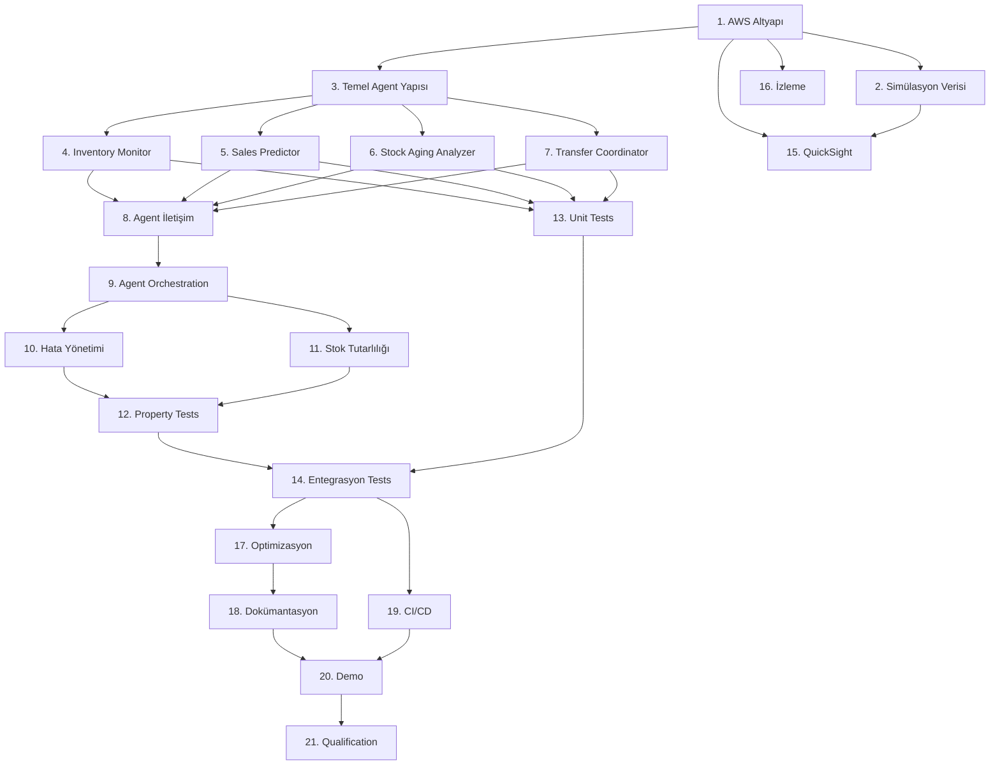

# Görevler ve Ekip Dağılımı

## Ekip Yapısı ve Roller

### Geliştirici 1: AWS Altyapı ve Agent Mimarisi Uzmanı
**Sorumluluklar:**
- AWS Bedrock Agent Core entegrasyonu
- Agent primitives implementasyonu
- DynamoDB ve S3 altyapısı
- IAM rolleri ve güvenlik

### Geliştirici 2: Agent Mantığı ve İş Kuralları Uzmanı
**Sorumluluklar:**
- Agent karar mantığı implementasyonu
- İş kuralları ve algoritmaları
- Agent iletişim protokolleri
- Stok yönetim mantığı

### Geliştirici 3: Test, Veri ve Görselleştirme Uzmanı
**Sorumluluklar:**
- Property-based ve unit testler
- Simülasyon verisi üretimi
- QuickSight dashboard'ları
- CI/CD pipeline

## Görev Listesi

### Faz 1: Altyapı ve Temel Kurulum (Hafta 1-2)

- [ ] 1. AWS Altyapı Kurulumu (Geliştirici 1)
  - [ ] 1.1 DynamoDB tablolarını oluştur (Warehouses, Products, Inventory, SalesHistory, Transfers, AgentDecisions)
  - [ ] 1.2 S3 bucket yapısını oluştur (raw-data, sales-history, agent-logs, reports)
  - [ ] 1.3 IAM rollerini ve politikalarını yapılandır (BedrockAgentRole, LambdaExecutionRole)
  - [ ] 1.4 Bedrock Agent Core için gerekli izinleri ayarla

- [ ] 2. Simülasyon Verisi Üretimi (Geliştirici 3)
  - [ ] 2.1 6 depo verisi üret (warehouses.json)
  - [ ] 2.2 10 kategori ve 100 SKU verisi üret (products.json)
  - [ ] 2.3 Her SKU için 12 aylık satış geçmişi üret (sales-history CSV'leri)
  - [ ] 2.4 Başlangıç stok seviyeleri üret (initial-inventory.json)
  - [ ] 2.5 Veri yükleme scriptlerini yaz (DynamoDB ve S3'e yükleme)
  - [ ] 2.6 Veri validasyon testleri yaz

- [ ] 3. Temel Agent Yapısı (Geliştirici 1)
  - [ ] 3.1 Bedrock Agent SDK entegrasyonunu kur
  - [ ] 3.2 BaseAgent sınıfını oluştur (ortak agent fonksiyonları)
  - [ ] 3.3 Agent konfigürasyon yönetimini implement et
  - [ ] 3.4 Agent loglama mekanizmasını kur

### Faz 2: Agent Implementasyonları (Hafta 3-5)

- [ ] 4. Inventory Monitor Agent (Geliştirici 2)
  - [ ] 4.1 Bedrock Agent oluştur (amazon.nova-lite-v1:0 modeli ile)
  - [ ] 4.2 Stok seviyesi izleme fonksiyonunu implement et
  - [ ] 4.3 Kritik stok tespiti algoritmasını yaz
  - [ ] 4.4 Stok geçmişi sorgulama fonksiyonunu implement et
  - [ ] 4.5 Düşük stok bildirimi mekanizmasını kur
  - [ ] 4.6 Nova model entegrasyonu ile stok trend analizi ekle

- [ ] 5. Sales Predictor Agent (Geliştirici 2)
  - [ ] 5.1 Bedrock Agent oluştur (amazon.nova-pro-v1:0 modeli ile)
  - [ ] 5.2 Geçmiş satış verisi analiz fonksiyonunu implement et
  - [ ] 5.3 Satış potansiyeli hesaplama algoritmasını yaz
  - [ ] 5.4 Mevsimsel trend tespiti ekle
  - [ ] 5.5 Bölgesel faktör hesaplama fonksiyonunu implement et
  - [ ] 5.6 Nova model ile satış tahmin prompt'larını optimize et

- [ ] 6. Stock Aging Analyzer Agent (Geliştirici 2)
  - [ ] 6.1 Bedrock Agent oluştur (amazon.nova-lite-v1:0 modeli ile)
  - [ ] 6.2 Yaşlandırma süresi hesaplama fonksiyonunu implement et
  - [ ] 6.3 Kritik yaşlandırma tespiti algoritmasını yaz
  - [ ] 6.4 Kategori bazlı eşik yönetimini implement et
  - [ ] 6.5 Yaşlı stok önceliklendirme mantığını ekle

- [ ] 7. Transfer Coordinator Agent (Geliştirici 2)
  - [ ] 7.1 Bedrock Agent oluştur (amazon.nova-pro-v1:0 modeli ile)
  - [ ] 7.2 Transfer ihtiyacı değerlendirme fonksiyonunu implement et
  - [ ] 7.3 Kaynak depo seçim algoritmasını yaz
  - [ ] 7.4 Hedef depo seçim algoritmasını yaz (satış potansiyeli entegrasyonu)
  - [ ] 7.5 Transfer miktarı hesaplama fonksiyonunu implement et
  - [ ] 7.6 Atomik transfer işlemi fonksiyonunu yaz (DynamoDB transactions)
  - [ ] 7.7 İnsan onayı mekanizmasını implement et (ReturnControl primitive)
  - [ ] 7.8 Nova model ile optimal transfer kararı prompt'larını yaz

### Faz 3: Agent İletişimi ve Koordinasyon (Hafta 6-7)

- [ ] 8. Agent İletişim Protokolü (Geliştirici 1 + 2)
  - [ ] 8.1 Agent mesajlaşma protokolünü tasarla
  - [ ] 8.2 Agent arası veri paylaşım mekanizmasını implement et
  - [ ] 8.3 Agent koordinasyon mantığını yaz
  - [ ] 8.4 Eşzamanlı kaynak erişim kontrolünü implement et (locking)
  - [ ] 8.5 Agent hata bildirimi mekanizmasını kur

- [ ] 9. Agent Orchestration (Geliştirici 1)
  - [ ] 9.1 Ana orchestration Lambda fonksiyonunu yaz
  - [ ] 9.2 Agent çağırma sırasını belirle
  - [ ] 9.3 Agent yanıtlarını toplama ve işleme mantığını implement et
  - [ ] 9.4 Bedrock Agent Core primitives kullanarak agent workflow'u oluştur

### Faz 4: Hata Yönetimi ve Dayanıklılık (Hafta 8)

- [ ] 10. Hata Yönetimi (Geliştirici 1)
  - [ ] 10.1 Bedrock API hata yönetimini implement et (retry, exponential backoff)
  - [ ] 10.2 Circuit breaker pattern'i uygula
  - [ ] 10.3 Veri tutarsızlığı hata yönetimini implement et (rollback)
  - [ ] 10.4 Agent iletişim hata yönetimini implement et (fallback)
  - [ ] 10.5 Hata loglama ve alerting mekanizmasını kur

- [ ] 11. Stok Tutarlılığı ve Validasyon (Geliştirici 2)
  - [ ] 11.1 Atomik transfer işlem validasyonunu implement et
  - [ ] 11.2 Negatif stok kontrolü ekle
  - [ ] 11.3 Eşzamanlı transfer tutarlılık kontrolünü implement et
  - [ ] 11.4 Günlük stok toplam doğrulama job'ı yaz
  - [ ] 11.5 Audit log mekanizmasını implement et

### Faz 5: Test ve Doğrulama (Hafta 9-10)

- [ ]* 12. Property-Based Testler (Geliştirici 3) *(OPTIONAL - MVP sonrası)*
  - [ ]* 12.1 Hypothesis test framework'ünü kur
  - [ ]* 12.2 Özellik 1-10 için property testleri yaz (stok yönetimi özellikleri)
  - [ ]* 12.3 Özellik 11-20 için property testleri yaz (agent koordinasyon özellikleri)
  - [ ]* 12.4 Özellik 21-32 için property testleri yaz (sistem özellikleri)
  - [ ]* 12.5 Test stratejilerini optimize et (warehouse, SKU, transfer stratejileri)

- [ ]* 13. Unit Testler (Geliştirici 3) *(OPTIONAL - MVP sonrası)*
  - [ ]* 13.1 Inventory Monitor Agent unit testleri yaz (minimum 20 test)
  - [ ]* 13.2 Sales Predictor Agent unit testleri yaz (minimum 20 test)
  - [ ]* 13.3 Stock Aging Analyzer Agent unit testleri yaz (minimum 20 test)
  - [ ]* 13.4 Transfer Coordinator Agent unit testleri yaz (minimum 20 test)
  - [ ]* 13.5 Edge case testleri yaz (sıfır stok, eşzamanlı transferler, vb.)

- [ ]* 14. Entegrasyon ve Simülasyon Testleri (Geliştirici 3) *(OPTIONAL - MVP sonrası)*
  - [ ]* 14.1 Agent arası iletişim entegrasyon testleri yaz
  - [ ]* 14.2 End-to-end transfer senaryosu testleri yaz
  - [ ]* 14.3 30 günlük tam simülasyon testi yaz (6 depo, 100 SKU)
  - [ ]* 14.4 Yüksek yük simülasyon testi yaz (1000+ eşzamanlı işlem)
  - [ ]* 14.5 Hata senaryosu testleri yaz (Bedrock timeout, DynamoDB throttling)

### Faz 6: Görselleştirme ve İzleme (Hafta 11)

- [ ] 15. QuickSight Dashboard'ları (Geliştirici 3)
  - [ ] 15.1 QuickSight veri kaynaklarını yapılandır (DynamoDB, S3)
  - [ ] 15.2 Stok seviyeleri dashboard'u oluştur
  - [ ] 15.3 Transfer metrikleri dashboard'u oluştur
  - [ ] 15.4 Agent kararları dashboard'u oluştur
  - [ ] 15.5 Satış tahminleri dashboard'u oluştur

- [ ] 16. İzleme ve Metrikler (Geliştirici 1)
  - [ ] 16.1 CloudWatch metriklerini yapılandır
  - [ ] 16.2 Agent performans metriklerini topla
  - [ ] 16.3 Bedrock kullanım metriklerini izle
  - [ ] 16.4 Alarm ve bildirim kurallarını ayarla

### Faz 7: Optimizasyon ve Dokümantasyon (Hafta 12)

- [ ] 17. Performans Optimizasyonu (Geliştirici 1 + 2)
  - [ ] 17.1 Agent yanıt sürelerini optimize et
  - [ ] 17.2 DynamoDB query'lerini optimize et
  - [ ] 17.3 Bedrock prompt'larını optimize et (token kullanımı)
  - [ ] 17.4 Rate limit yönetimini optimize et

- [ ] 18. Dokümantasyon (Tüm Ekip)
  - [ ] 18.1 API dokümantasyonu yaz
  - [ ] 18.2 Agent davranış dokümantasyonu yaz
  - [ ] 18.3 Deployment guide yaz
  - [ ] 18.4 Kullanıcı kılavuzu yaz
  - [ ] 18.5 Troubleshooting guide yaz

- [ ]* 19. CI/CD Pipeline (Geliştirici 3) *(OPTIONAL - MVP sonrası)*
  - [ ]* 19.1 GitHub Actions workflow'larını kur
  - [ ]* 19.2 Otomatik test çalıştırma pipeline'ı oluştur
  - [ ]* 19.3 Code coverage raporlama ekle
  - [ ]* 19.4 Otomatik deployment pipeline'ı kur (dev, staging, prod)

### Faz 8: Demo ve Teslim (Hafta 13)

- [ ] 20. Demo Hazırlığı (Tüm Ekip)
  - [ ] 20.1 Demo senaryolarını hazırla
  - [ ] 20.2 Demo verilerini yükle
  - [ ] 20.3 Demo ortamını kur
  - [ ] 20.4 Sunum materyallerini hazırla

- [ ] 21. AWS AI Agent Qualification (Tüm Ekip)
  - [ ] 21.1 Reasoning LLM kullanımını doğrula
  - [ ] 21.2 Otonom karar verme yeteneklerini doğrula
  - [ ] 21.3 İnsan müdahalesi senaryolarını doğrula
  - [ ] 21.4 Qualification dokümantasyonunu hazırla

## Haftalık Sprint Planı

### Sprint 1-2 (Hafta 1-2): Altyapı
- Görevler: 1, 2, 3
- Çıktı: AWS altyapısı hazır, simülasyon verisi yüklü, temel agent yapısı kurulu

### Sprint 3-5 (Hafta 3-5): Agent Geliştirme
- Görevler: 4, 5, 6, 7
- Çıktı: 4 agent tamamen implement edilmiş ve çalışır durumda

### Sprint 6-7 (Hafta 6-7): Koordinasyon
- Görevler: 8, 9
- Çıktı: Agentlar birbirleriyle iletişim kurabiliyor, orchestration çalışıyor

### Sprint 8 (Hafta 8): Dayanıklılık
- Görevler: 10, 11
- Çıktı: Hata yönetimi ve stok tutarlılığı garantileri yerinde

### Sprint 9-10 (Hafta 9-10): Test
- Görevler: 12, 13, 14
- Çıktı: Tüm testler yazılmış ve geçiyor, %80+ kod kapsamı

### Sprint 11 (Hafta 11): Görselleştirme
- Görevler: 15, 16
- Çıktı: QuickSight dashboard'ları ve izleme sistemi aktif

### Sprint 12 (Hafta 12): Optimizasyon
- Görevler: 17, 18, 19
- Çıktı: Sistem optimize edilmiş, dokümante edilmiş, CI/CD kurulu

### Sprint 13 (Hafta 13): Demo
- Görevler: 20, 21
- Çıktı: Demo hazır, AWS qualification tamamlanmış

## Bağımlılıklar

## Kritik Başarı Faktörleri

1. **AWS Bedrock Entegrasyonu**: Bedrock Agent Core ve Nova modellerinin doğru kullanımı
2. **Agent Koordinasyonu**: Agentların etkili iletişimi ve tutarlı kararlar alması
3. **Stok Tutarlılığı**: Hiçbir durumda negatif stok veya veri tutarsızlığı olmaması
4. **Test Kapsamı**: Tüm 32 özelliğin property testlerle doğrulanması
5. **Performans**: 10 saniye altında transfer kararları, 1000+ eşzamanlı işlem desteği

## Risk Yönetimi

| Risk | Olasılık | Etki | Azaltma Stratejisi |
|------|----------|------|-------------------|
| Bedrock rate limiting | Yüksek | Orta | Circuit breaker, exponential backoff, rate limit monitoring |
| Agent karar kalitesi | Orta | Yüksek | Prompt engineering, A/B testing, human-in-the-loop |
| Veri tutarsızlığı | Orta | Yüksek | Atomik işlemler, validasyon, audit logs |
| Performans sorunları | Orta | Orta | Erken optimizasyon, load testing, caching |
| Test kapsamı yetersizliği | Düşük | Yüksek | Property-based testing, code coverage monitoring |

## Teslim Kriterleri

- [ ] Tüm MVP görevleri tamamlanmış (test ve CI/CD optional)
- [ ] Tüm agentlar AWS Bedrock üzerinde çalışıyor
- [ ] Agent'lar arası iletişim ve koordinasyon çalışıyor
- [ ] Transfer kararları doğru şekilde veriliyor
- [ ] QuickSight dashboard'ları aktif
- [ ] Dokümantasyon tamamlanmış
- [ ] AWS AI Agent Qualification kriterleri karşılanmış
- [ ] Demo başarıyla gerçekleştirilmiş
